<p align="center">
  
</p>

<p align="center">
  <strong>Vercel-like developer experience for Kubernetes teams.</strong><br />
  Open source. GitOps-native. Built on CNCF projects.<br />
  <a href="https://suparship.io/">suparship.io</a>
</p>

---

## What is suparship?

**suparship** is an open-source platform runtime from **suparCloud** that lets small SRE / DevOps teams provide a **simple, self-service PaaS-like experience** to developers — without building or maintaining a full platform team.

It standardizes the *golden paths* for:
- deploying applications
- creating preview environments
- promoting safely to production

…while using **proven open-source tools** like ArgoCD and Kargo under the hood.

> If you can run Kubernetes, you can run a great platform.

---

## Why suparship?

Most teams want:
- preview environments for every change
- consistent deploy workflows
- safe promotions to production

But they:
- don’t have time to build an internal platform
- don’t want vendor lock-in
- eventually outgrow hosted PaaS solutions

**suparship sits in the middle**:
- simple like a PaaS
- flexible like Kubernetes
- transparent like GitOps

---

## See it in action

What a developer sees, captured from the
[one-command shipnotes demo](docs/contributor-guide/hacking-on-suparship.md)
(`task up` + `task demo:shipnotes` — a React + FastAPI + Postgres app through
the whole golden path).

**A project dashboard, not a wall of YAML.** Apps with live health per environment
and their URLs:

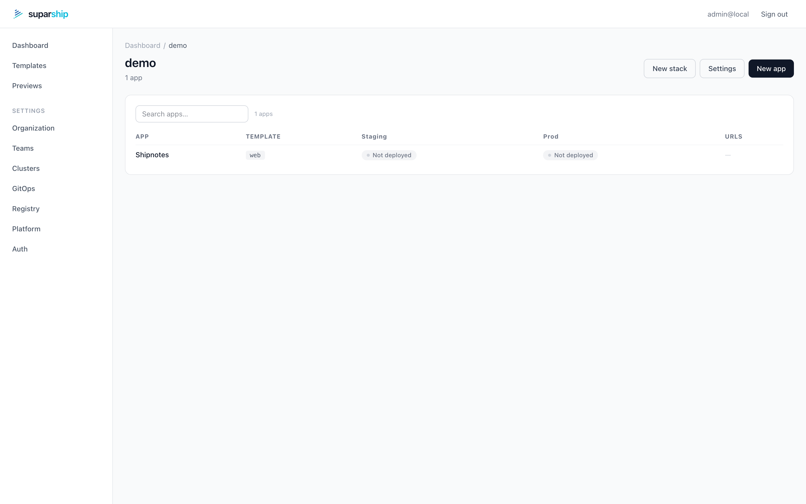

**Each app is a pipeline.** Staging promotes to prod; the `pr-1` badge is a live
preview environment from an open pull request. Release tag, endpoints, and
components on one page:

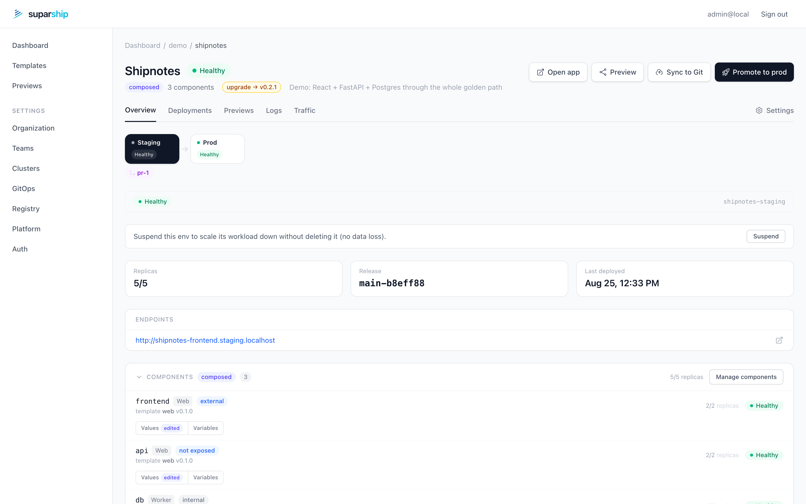

**Developers configure apps through a curated form, not a values dump.** The
platform team picks which Helm values each template exposes; untouched fields keep
inheriting platform defaults, and the Advanced toggle still shows everything.
`Container port` writes both `containerPort` and `service.port` — one question,
two keys:

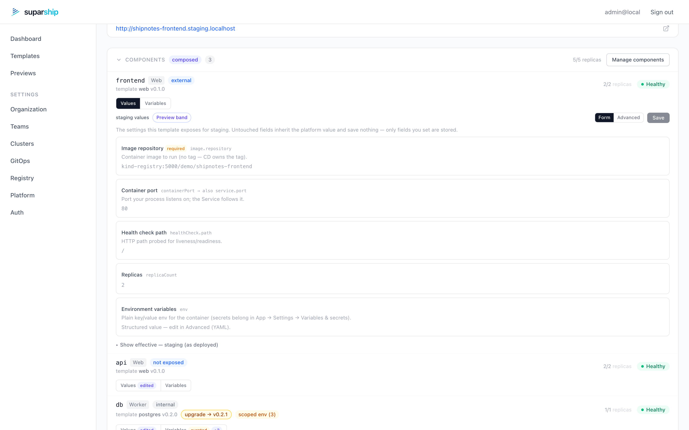

**Prefer YAML? The Advanced view is the same contract.** Your override is seeded
as commented lines — uncomment one to own it, and `((platform.*))` tokens wire
chart values to platform-managed objects (env ConfigMap/Secret, routing host,
image tag) without hardcoding anything per environment:

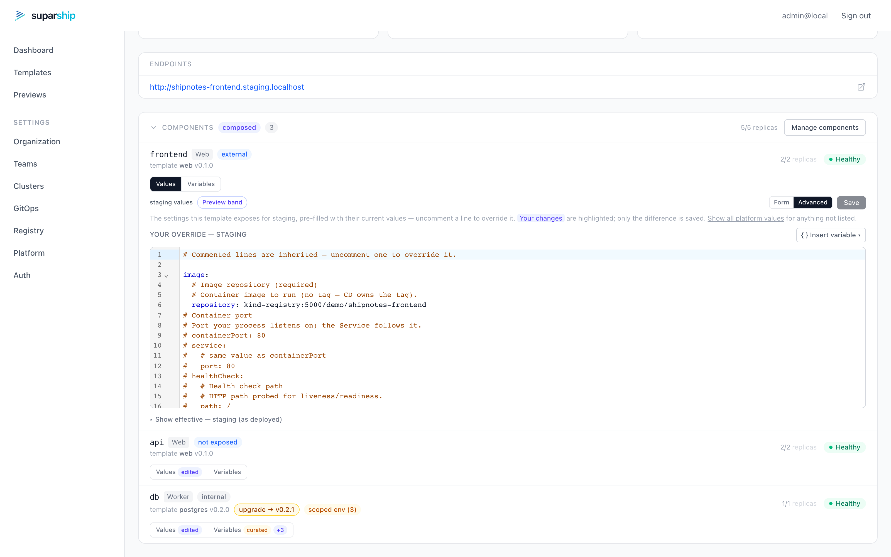

**Secrets stay out of git and out of the way.** App-level variables and
Vault-backed secrets are mapped per component — the database sees exactly the
keys it needs, nothing else:

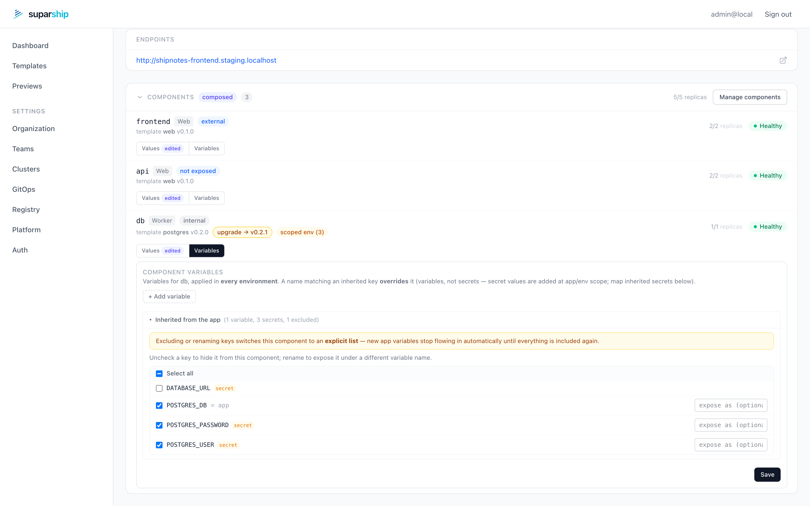

**One place for variables and secrets, scoped per environment.** App-level
values apply everywhere (with a guardrail banner reminding you that includes
production); each environment and even each cluster gets its own overriding
scope:

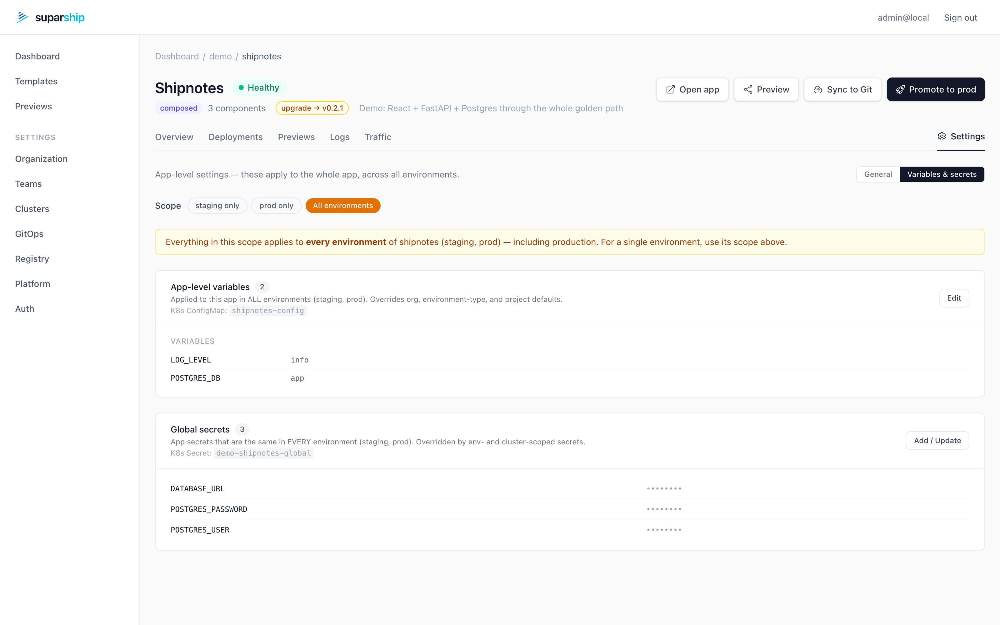

**And you can always see what actually reaches an environment.** The resolved
view merges the whole hierarchy (org → environment → project → app → app-env)
and attributes every key: here staging *extends* the app config with
`FEATURE_FLAGS`, *overrides* `LOG_LEVEL`, and inherits the rest:

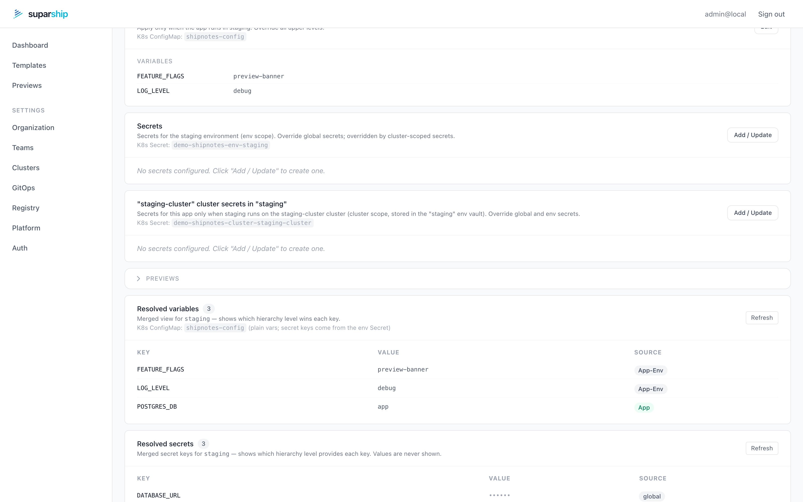

**Every pull request gets its own environment**, built at the PR's image tag,
with its own URL and its own database, torn down on merge:

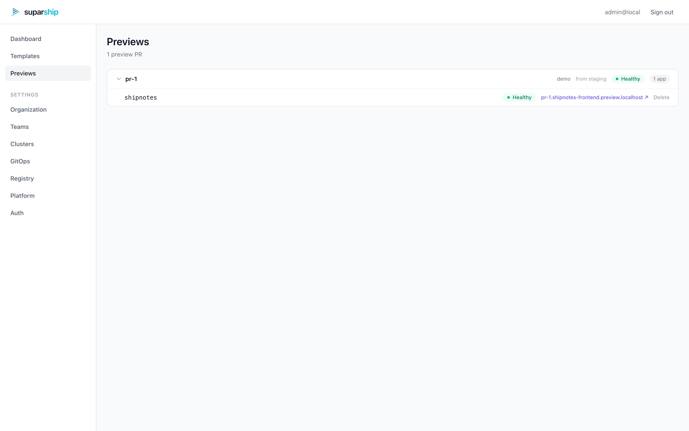

**Production is one click, and gated.** Merge ships staging; promotion re-tags
the exact staging release to prod via Kargo — and rollback is one click too:

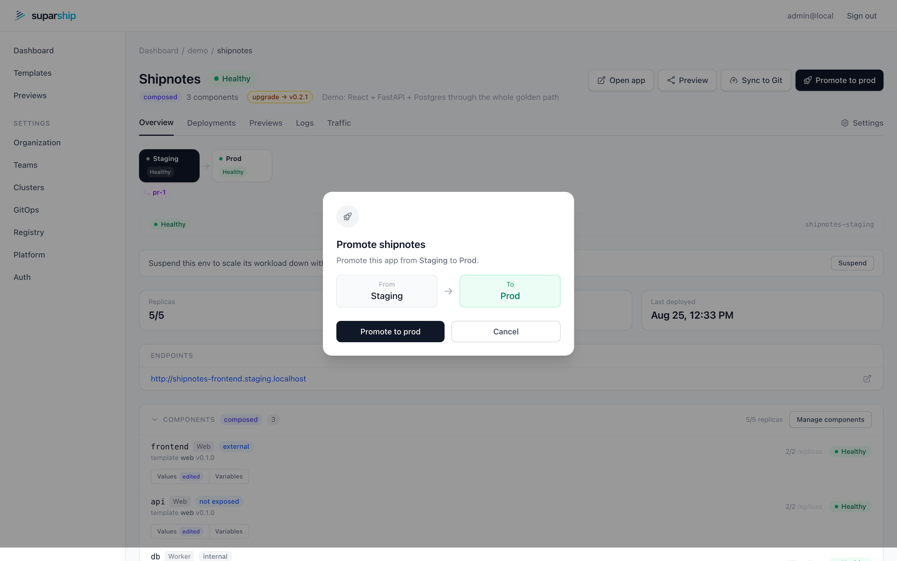

**Any Helm chart is a template.** No golden-cage DSL — bring your own charts,
curate them once, and developers self-serve from the gallery:

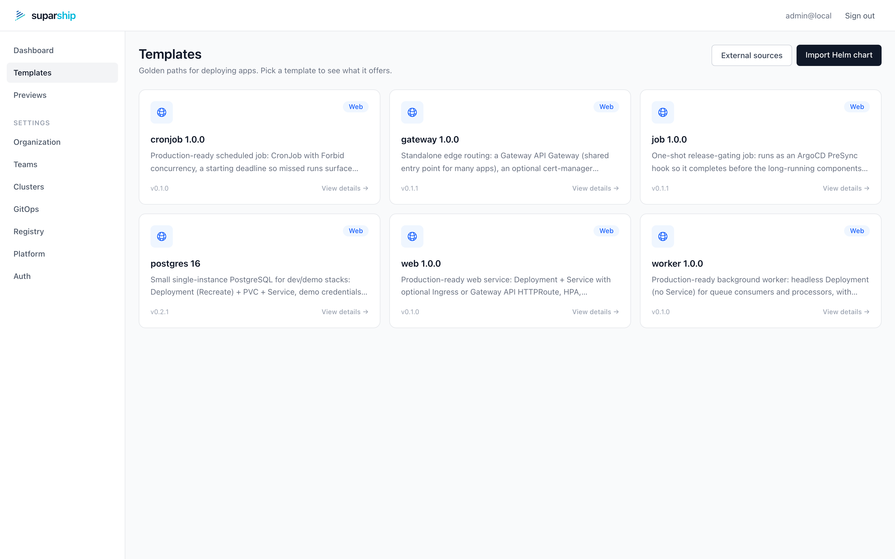

**Creating an app is a form, end to end.** Pick a template, name the app, and
configure the component through the same curated fields — deployment targets,
namespace strategy, delivery mode, and optional variables/secrets are all one
page:

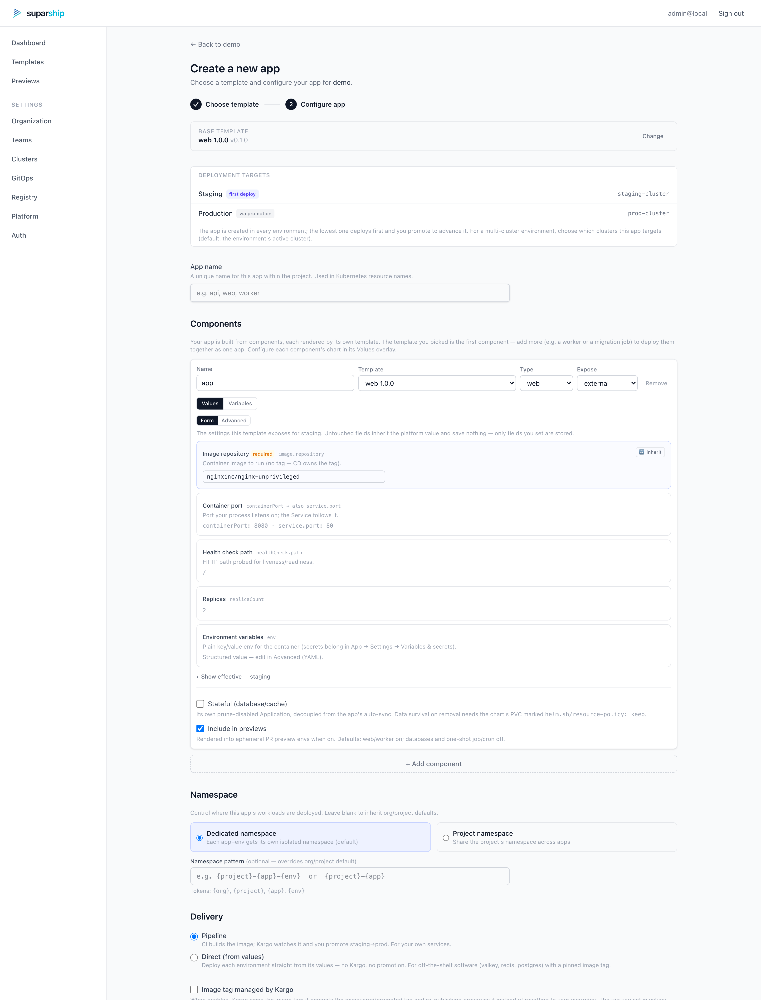

**Platform engineers curate once, per template.** CD image wiring, the
developer-values projection, and org value overlays — global, per environment,
per cluster, and preview-only — with `((platform.*))` tokens and a live
effective-values pane. Here staging gets a smaller resource baseline than prod,
and every app inherits the platform's env objects:

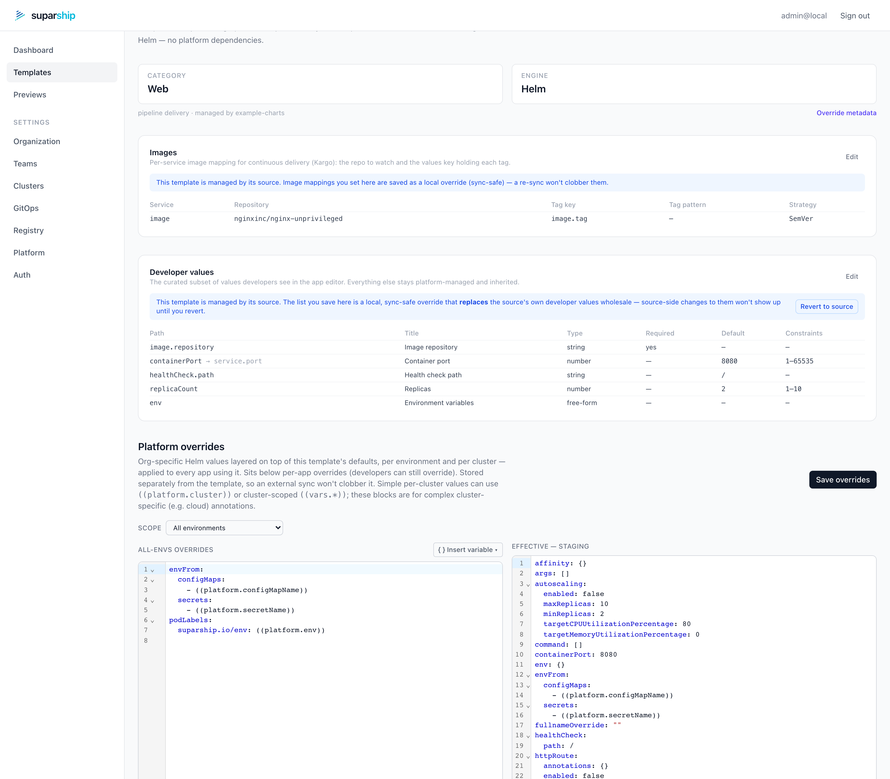

---

## Key concepts

suparship is built around a four-level hierarchy:

```
org
└── project          (team / product boundary)
    └── app          (primary developer-owned object)
        ├── environment  (staging | prod | preview-*)
        └── component    (composed apps only; each a chart + values of its own)
```

- **App** – the unit of deployment. What a developer creates, configures,
  previews, and promotes. Top-level navigation object within a project.
- **Environment** – a runtime context for an app (`staging`, `prod`, or an
  ephemeral `preview-*`). An environment is a lens on an app, not a top-level
  container. Environments are defined at the org level and shared by all projects.
- **Component** – a chart-backed workload within a *composed* app, declared by
  the user with its own template and values. A plain single-chart app has none.
- **Project** – a team / product boundary that groups apps. All projects inherit
  the org's ordered environment list for their promotion pipelines.
- **Template** – a plain Helm chart (plus optional curated metadata) served
  from the template registry; apps are created from templates.

Developers think in:
> *app → environment → preview → promote*

SREs define:
> *defaults, templates, and guardrails*

> **Note:** some internal code paths and the legacy API still use the term
> `service` during an ongoing migration. New external API routes use `app`.
> See [ADR-0001](docs/adr/0001-app-as-primary-deployment-object.md) and
> [docs/app-model.md](docs/app-model.md) for details.

---

## Quickstart

Two ways to start, depending on whether you want to *try* suparship or *run* it.

### A. Try it locally — no cluster, no cloud (~1 min)

Runs the whole backend in-process with seeded demo data, so you can click through
the UI immediately.

```bash
git clone https://github.com/suparcloud/suparship && cd suparship
cp .env.example .env          # SUPARSHIP_DEV_MODE=local; admin@local / admin123
task dev                      # backend (fake) on :8080 + UI on :5173
```

Open the UI and sign in with **`admin@local` / `admin123`**. Details in
[Local Fake Mode](#local-fake-mode-contributor-default).

Want the real thing — a kind cluster with GitOps, CI, previews, and promotion,
plus a **working demo app** to poke at? (macOS and Linux)

```bash
task dev:dns          # once per machine: *.localhost → 127.0.0.1 (no-op if it already resolves)
task up               # full dev cluster (Tilt) — ingress, Vault, CI runner
task demo:shipnotes   # second terminal: deploys the shipnotes demo end-to-end
# → http://shipnotes-frontend.staging.localhost  (PR → preview, promote → prod)
```

The guided tour lives in [**docs/try-suparship.md**](docs/try-suparship.md).

### B. Install in production (Helm)

suparship runs in a **hub** (tooling) cluster and deploys your apps there — or to
registered **remote** clusters — via ArgoCD. Prerequisites on the tooling
cluster: ArgoCD, Kargo, External Secrets Operator, and **sealed-secrets** (the
controller suparship uses to deliver per-cluster secret-backend tokens and to
export your config with encrypted credentials). Full matrix in
[docs/install.md](docs/install.md).

The intended flow is **install thin, configure in the UI, then commit the
exported config to git**:

**1. Basic setup via Helm** — org name, environments, admin secret ref:

```bash
cp examples/values.yaml my-values.yaml   # annotated example; edit for your org

helm install suparship ./charts/suparship \
  --namespace suparship-system --create-namespace \
  -f my-values.yaml

# one-time break-glass credential (printed once):
suparship admin bootstrap
```

**2. Configure the platform in the UI** (Settings, as `org_admin`):

- **GitOps** — connect the gitops repo (URL + credentials, Test connection)
- **Registry** — container registry the CD pipeline watches
- **Secrets backend** — HashiCorp Vault or 1Password; paste the per-cluster
  tokens so suparship seals and publishes each cluster's read credentials
- **Clusters & environments** — register clusters, bind `staging`/`prod`
- Optionally [single sign-on](docs/sso.md) and local users with invite links

Work through the day-1 runbook — [**docs/install.md**](docs/install.md) — until
the Platform page's setup checklist is green, then verify against the
[acceptance checklist](docs/acceptance.md).

**3. Commit the whole configuration to git** — Platform → *Export
Configuration* → **Download values.yaml (sealed credentials)** (or
`GET /api/v1/org/export?includeSecrets=1&format=yaml`). The export is the full
Helm values for your install **plus every platform credential as a
`SealedSecret` under `extraObjects`** — encrypted for your cluster's
sealed-secrets controller, so the file is safe to commit. A
`helm upgrade -f` of that file reproduces the entire setup, credentials
included.

> Back up the sealed-secrets controller key (standard practice): the sealed
> blobs decrypt only with it, so disaster recovery onto a fresh cluster means
> restoring that key first — and re-export after any key rotation.

---

## Running the API Server

Start the built-in HTTP server:

```bash
suparship server              # listens on :8080
suparship server --addr :9090 # custom address
```

### Server flags

| Flag | Env var | Default | Description |
|------|---------|---------|-------------|
| `--addr` | `SUPARSHIP_ADDR` | `:8080` | Listen address |
| `--ui-dir` | `SUPARSHIP_UI_DIR` | | Path to built frontend assets |
| `--cors-origins` | `SUPARSHIP_CORS_ORIGINS` | | Comma-separated allowed origins |
| `--cookie-secure` | `SUPARSHIP_COOKIE_SECURE` | `false` | Set `Secure` flag on session cookies (enable behind HTTPS) |

### Endpoints

| Method | Path | Auth | Description |
|--------|------|------|-------------|
| GET | `/healthz` | — | Liveness probe — returns `ok` |
| GET | `/readyz` | — | Readiness probe — returns `ok` |
| GET | `/api/v1/meta` | — | JSON build metadata (app, version, commit, date) |
| GET | `/api/v1/onboarding/status` | — | Onboarding checklist (auth, org, projects, envs, apps) |
| POST | `/api/v1/auth/login` | — | Authenticate with username/password, returns session cookie |
| POST | `/api/v1/auth/logout` | — | Destroy session and clear cookie |
| GET | `/api/v1/auth/me` | session | Return current user identity and role |
| GET | `/api/v1/org` | session | Return org name, display name, created at |
| GET | `/api/v1/teams` | session | List all teams with members |
| GET | `/api/v1/projects` | session | List all projects with display name and description |
| GET | `/api/v1/projects/{project}` | viewer | Get project detail — name, description, environments, apps |
| GET | `/api/v1/projects/{project}/rbac` | viewer | List role bindings for a project |
| PUT | `/api/v1/projects/{project}` | project_admin | Update project (placeholder) |
| GET | `/api/v1/environments` | session | List all environments across projects |
| GET | `/api/v1/projects/{project}/environments` | viewer | List environments for a project |
| POST | `/api/v1/projects/{project}/environments` | project_admin | Create a project environment |
| GET | `/api/v1/projects/{project}/environments/{env}` | viewer | Get a project environment |
| PUT | `/api/v1/projects/{project}/environments/{env}` | project_admin | Update a project environment |
| DELETE | `/api/v1/projects/{project}/environments/{env}` | project_admin | Delete a project environment |
| GET | `/api/v1/projects/{project}/apps` | viewer | List apps with runtime state |
| POST | `/api/v1/projects/{project}/apps` | developer | Create app from template |
| GET | `/api/v1/projects/{project}/apps/{app}` | viewer | App detail with per-env runtime state |
| GET | `/api/v1/projects/{project}/apps/{app}/environments` | viewer | List app environment instances |
| GET | `/api/v1/projects/{project}/apps/{app}/environments/{env}` | viewer | App environment detail |
| GET | `/api/v1/projects/{project}/apps/{app}/previews` | viewer | List previews for a specific app |
| POST | `/api/v1/projects/{project}/apps/{app}/previews` | developer | Create a preview environment |
| DELETE | `/api/v1/projects/{project}/apps/{app}/previews/{name}` | developer | Delete a preview environment |
| POST | `/api/v1/projects/{project}/apps/{app}/promote` | project_admin | Promote app to target environment |
| GET | `/api/v1/projects/{project}/apps/{app}/logs` | viewer | Fetch pod logs for an app |
| GET | `/api/v1/projects/{project}/tokens` | project_admin | List a project's API tokens (metadata only) |
| POST | `/api/v1/projects/{project}/tokens` | project_admin | Mint a project API token (plaintext returned once) |
| DELETE | `/api/v1/projects/{project}/tokens/{id}` | project_admin | Revoke a project API token |
| GET | `/api/v1/clusters` | session | List registered clusters |
| POST | `/api/v1/clusters` | org_admin | Register a new cluster |
| GET | `/api/v1/clusters/{name}` | session | Get cluster detail |
| DELETE | `/api/v1/clusters/{name}` | org_admin | Remove a registered cluster |
| GET | `/api/v1/templates` | session | List all available templates |
| GET | `/api/v1/templates/{name}` | session | Get full template detail for form generation |
| GET | `/api/v1/org/users` | org_admin | List local (invite-provisioned) users |
| POST | `/api/v1/org/users` | org_admin | Create a local user + one-time invite link (optionally join teams) |
| POST | `/api/v1/org/users/{username}/invite` | org_admin | Re-issue an invite (doubles as password reset) |
| DELETE | `/api/v1/org/users/{username}` | org_admin | Delete a local user (strips team memberships) |
| GET | `/api/v1/auth/invite/{token}` | — | Validate an invite link (set-password page) |
| POST | `/api/v1/auth/invite/accept` | — | Redeem a one-time invite: set password, sign in |
| GET | `/api/v1/org/endpoints` | session | Read the secure-endpoints (https/http URL scheme) setting |
| PUT | `/api/v1/org/endpoints` | org_admin | Update the secure-endpoints setting |
| GET | `/api/v1/org/export` | org_admin | Export platform config as Helm values (`?format=yaml`, `?includeSecrets=1` adds SealedSecrets) |

> Legacy `/projects/{project}/services/...` paths remain registered for backward compatibility.

Auth endpoints are enabled automatically when a Kubernetes cluster is
reachable (they validate against the `suparship-admin-auth` Secret).
RBAC-protected routes require both auth and an org config provider.
Session cookies are `HttpOnly` and `SameSite=Lax`.

---

## Local Fake Mode (contributor default)

**Local fake mode** runs the entire backend in-process using seeded demo data.
No Kubernetes cluster, no ArgoCD, no Kargo — nothing external is required.

This is the **recommended starting point** for contributors working on UI or
API features.

### Activate

Copy `.env.example` to `.env` (already done if you followed the quickstart):

```bash
cp .env.example .env
```

`.env.example` sets `SUPARSHIP_DEV_MODE=local` which activates fake mode
automatically.  You can also set `SUPARSHIP_CLUSTER_MODE=fake` directly; both
are equivalent.  `SUPARSHIP_DEV_MODE=local` takes precedence if both are set.

### Start the server

```bash
# load .env then start the API
source .env && go run ./cmd/suparship server
```

Expected startup output:

```
level=INFO msg="runtime mode: fake — in-memory seed data, no cluster required" trigger=SUPARSHIP_DEV_MODE=local login=admin@local password_env=SUPARSHIP_ADMIN_PASSWORD
level=INFO msg="auth endpoints enabled"
...
level=INFO msg="server listening" addr=:8080
```

### Login credentials

| Field | Default | Override via |
|-------|---------|--------------|
| Username | `admin@local` | `SUPARSHIP_ADMIN_EMAIL` |
| Password | `admin123` | `SUPARSHIP_ADMIN_PASSWORD` |

These defaults match `.env.example`.  Override them in your local `.env` for a
custom dev identity.

**Auth endpoints:**

| Method | Path | Description |
|--------|------|-------------|
| `POST` | `/api/v1/auth/login` | Login with `{"username": "...", "password": "..."}` — returns session cookie |
| `POST` | `/api/v1/auth/logout` | Clear session cookie |
| `GET` | `/api/v1/auth/me` | Return the authenticated user (`username`, `role`) |

> **Warning:** fake mode credentials are plain-text and intentionally weak.
> They are only for contributor local development.  Never use them in production.

### What you get out of the box

| Resource | Value |
|----------|-------|
| Login | `admin@local` / `admin123` |
| Org | `default` — My Organization |
| Project | `demo` — Demo Project |
| Environments | `staging` (Order=1), `prod` (Order=2) — seeded from org config |
| Templates | `web`, `worker`, `cronjob`, `postgres` (mirroring `examples/charts/`) |
| Apps | `notes-web` (single `web` chart), `api-gateway` (composed) |
| Preview | `pr-42` (on `notes-web`) |
| Runtime status | `healthy` with fake ingress URLs |
| Logs | Sample log lines (deterministic) |

All writes (new services, previews, etc.) are **in-memory only** and reset on
the next restart.

### Runtime mode reference

| `SUPARSHIP_DEV_MODE` | `SUPARSHIP_CLUSTER_MODE` | Active mode |
|----------------------|--------------------------|-------------|
| `local` | any | fake |
| _(unset)_ | `fake` | fake |
| _(unset)_ | _(unset)_ | kubernetes |

### Which mode should I use?

| Situation | Recommended mode | How to activate |
|-----------|-----------------|-----------------|
| Working on UI or API features, no cluster needed | **fake** | `SUPARSHIP_DEV_MODE=local` in `.env` (already the default in `.env.example`) |
| Testing real K8s integration locally | **kubernetes** | Unset `SUPARSHIP_DEV_MODE`; ensure `kubectl cluster-info` works |
| Running inside a Kubernetes Pod (in-cluster) | **kubernetes** | Unset `SUPARSHIP_DEV_MODE`; no kubeconfig needed — in-cluster config is auto-detected |
| CI / automated tests against a real cluster | **kubernetes** | Set `KUBECONFIG` to a valid kubeconfig path |

**Kubernetes mode startup:** the server logs exactly which kubeconfig and
context it will use before attempting to connect. If the cluster is
unreachable the server exits immediately with an actionable error message
rather than starting in a degraded state.

```
level=INFO msg="runtime mode: kubernetes" kubeconfig="auto (KUBECONFIG env → ~/.kube/config → in-cluster)" context="current context"
level=INFO msg="kubernetes client ready"
```

If the connection fails you will see:

```
runtime mode is "kubernetes" but no Kubernetes cluster is reachable: …

To fix:
  • Local development (no cluster needed): set SUPARSHIP_DEV_MODE=local in .env
  • Cluster access: ensure KUBECONFIG points to a valid kubeconfig file
  • Diagnose connectivity: kubectl cluster-info
```

---

## Admin Auth

suparship uses a single bootstrap admin account stored as a Kubernetes Secret
in the `suparship-system` namespace.

### Bootstrap the admin user

```bash
suparship admin bootstrap                  # username defaults to "admin"
suparship admin bootstrap --username ops   # custom username
suparship admin bootstrap --force          # overwrite existing credentials
```

The generated password is printed once — save it immediately.

### Reset the admin password

```bash
suparship admin reset-password
```

The username is preserved; only the password is regenerated.

### Secret layout

The credentials are stored in `suparship-system/suparship-admin-auth`:

```yaml
apiVersion: v1
kind: Secret
metadata:
  name: suparship-admin-auth
  namespace: suparship-system
type: Opaque
stringData:
  username: admin
  password-hash: $2a$12$...   # bcrypt hash — never plaintext
```

---

## Authorization Model

suparship uses a single-org RBAC model. The org configuration is stored in a
Kubernetes ConfigMap (`suparship-system/suparship-org-config`).

### Roles (highest → lowest privilege)

| Role | Description |
|------|-------------|
| `org_admin` | Full access to all projects and settings |
| `project_admin` | Full access within assigned projects |
| `developer` | Deploy and manage services in assigned projects |
| `viewer` | Read-only access to assigned projects |

Higher roles implicitly satisfy lower role requirements.

### Data structure

```yaml
# ConfigMap: suparship-system/suparship-org-config
# Key: org.yaml
name: default
displayName: My Organization
createdAt: "2026-03-27T00:00:00Z"
environments:
  - name: staging
    displayName: Staging
    order: 1
    clusterRefs: [in-cluster]     # registered cluster name(s)
    activeClusterRef: in-cluster  # which one receives deploys
    baseDomain: staging.example.com
  - name: prod
    displayName: Production
    order: 2
    clusterRefs: [prod-cluster]   # empty/omitted = env is UNBOUND, nothing deploys
    activeClusterRef: prod-cluster
    baseDomain: prod.example.com
teams:
  - name: admins
    displayName: Administrators
    members: [admin]
  - name: backend
    displayName: Backend Team
    members: [alice, bob]
roleBindings:
  - project: "*"        # wildcard = all projects
    team: admins
    role: org_admin
  - project: api
    team: backend
    role: developer
```

### Org environments and promotion pipeline

Org environments are the **single source of truth** for which environments an app
is deployed to and in what order.

- `staging` + `prod` are **seeded by default** during installation. Operators may
  add, rename, or remove environments via `POST/PUT/DELETE /api/v1/org/environments`.
- `order` drives the Kargo Stage chain: the env with the lowest `order` pulls
  directly from the Warehouse; each subsequent env gates on the previous one.
- A single-env org produces one Kargo Stage with no upstream; no `prod` stage is
  silently created.
- Creating an app when **no environments are registered** returns 400 with an
  actionable error pointing to the environment registration endpoint.
- `clusterRef` references a registered cluster (via `suparship cluster add`).
  When empty the environment is defined but not yet bound to a cluster.
- Preview environments are out-of-band (not registered in org envs) and always
  sit before the first stable env in promotions.

### Role resolution

For a given user and project:

1. Find all teams the user belongs to.
2. Collect role bindings that match the project (exact match or wildcard `*`).
3. Return the highest-privilege role across all matching bindings.

---

## Project & app model

> **Current persistence format.** The YAML stored in Kubernetes ConfigMaps
> still uses `services:` as the key for apps. This is a legacy field that the
> backend maps to the canonical `App` model on read. New API routes use the
> `app` terminology. See [`docs/app-model.md`](docs/app-model.md) for the
> conceptual model and [`docs/migration-app-model.md`](docs/migration-app-model.md)
> for the migration guide.

Projects and apps are stored as Kubernetes ConfigMaps in the
`suparship-system` namespace (one ConfigMap per project, named
`suparship-project-{name}`).

### Project spec

```yaml
apiVersion: suparship.io/v1alpha1
kind: Project
metadata:
  name: myapi
spec:
  displayName: My API
  description: The main API project
  environments:
    - name: dev
      displayName: Development
      order: 1
    - name: staging
      order: 2
    - name: prod
      displayName: Production
      order: 3
  services:
    - name: api
      template:
        name: web
        version: "1.0.0"
      values:
        image:
          repository: ghcr.io/org/api
      secretRefs:
        - name: database_url
          secretRef: api-db.url
      environmentOverrides:
        prod:
          values:
            replicas: 3
          secretRefs:
            - name: database_url
              secretRef: api-db-prod.url
```

### Hierarchy

| Level | Description |
|-------|-------------|
| Org | Single organization (from RBAC model) |
| Project | Logical grouping with its own environments |
| Environment | Ordered deployment target, driven by org `Order` field (e.g. dev → staging → prod) |
| App | Deployable workload referencing a template (stored as `service` in legacy YAML) |

### App fields (stored as `service` in legacy YAML)

| Field | Required | Description |
|-------|----------|-------------|
| `name` | yes | DNS-compatible service name |
| `template.name` | yes | Template to use for rendering |
| `template.version` | no | Pin to a specific template version |
| `values` | no | Helm values overlay in the chart's own shape |
| `secretRefs` | no | Secret references (written to vault, pulled by ESO) |
| `environmentOverrides` | no | Per-environment value and secret overrides |

### Runtime inventory

The app endpoints (`GET /api/v1/projects/{project}/apps` and
`GET .../apps/{app}`) merge desired config from the project store
with live state from Kubernetes Deployments and Ingresses.

**Namespace convention**: namespaces are derived from the environment's
`namespacePattern` (default `{app}-{env}`),
e.g. app `hello` in environment `staging` → namespace `hello-staging`.
On dedicated clusters the pattern can be set to `{app}` for a clean
single-namespace-per-app layout.

If the Kubernetes API is unreachable or a Deployment does not exist, the
runtime status degrades gracefully to `not_deployed` without returning an
error.

### Preview environments

Previews are ephemeral, branch-scoped deployments of an app. Each
preview is stored as a ConfigMap (`suparship-preview-{name}`) in
`suparship-system`.

**Namespace convention**: `{app}-{previewName}` (default pattern),
e.g. app `hello` with preview `pr-42` → namespace `hello-pr-42`.

Preview status and ingress URL are read from the Kubernetes runtime when
available, otherwise the status is `not_deployed`.

Creating or deleting a preview requires at least `developer` role on the
target project. Listing previews is available to any authenticated user.

### App promotion

The `POST /api/v1/projects/{project}/apps/{app}/promote` endpoint
promotes an app from one environment to the next in the org's environment pipeline.

**Promotion pipeline** is driven by `OrgEnvironment.Order`: the environment with the
highest `Order` strictly below the target's `Order` is chosen as the source (closest
predecessor). Preview environments fall back to any earlier stable env that has been
deployed.

**Request body**: `{ "targetEnvironment": "prod" }`

The handler validates that both the project and app exist, the target
environment is defined and is not a preview, and a source environment exists.
The source is automatically determined from the `Order` field — no hardcoded
`staging → prod` assumption.

**Authorization**: requires `project_admin` role or above on the project.

When Kargo is integrated, this triggers a Kargo Stage promotion CR.

### Container logs

The `GET /api/v1/projects/{project}/services/{service}/logs` endpoint
proxies Kubernetes pod logs for a service.

**Query parameters**:

| Param | Required | Description |
|-------|----------|-------------|
| `environment` | yes | Target environment (determines namespace) |
| `pod` | no | Specific pod name; auto-selects first matching pod if omitted |
| `container` | no | Specific container; uses default if omitted |
| `tailLines` | no | Number of lines from the end of the log to return |

Pods are discovered by label `app.kubernetes.io/name={service}` (with
`app={service}` as fallback). When no pods are found, a 404 is returned
with a descriptive message.

**Authorization**: requires `viewer` role or above on the project. Log
output is capped at 1 MiB per request to prevent memory issues. Streaming
(`follow=true`) is reserved for a future commit.

---

## Architecture Decisions

Significant design decisions are recorded as Architecture Decision Records (ADRs) under [`docs/adr/`](docs/adr/README.md).

| ADR | Title | Status |
|-----|-------|--------|
| [ADR-0001](docs/adr/0001-app-as-primary-deployment-object.md) | App as Primary User-Facing Deployment Object | Accepted |

### Key design documents

| Document | Purpose |
|----------|---------|
| [`docs/app-model.md`](docs/app-model.md) | App, Environment, and Component concepts and guardrails |
| [`docs/secrets.md`](docs/secrets.md) | Secrets architecture: 1Password integration, provisioning, audit policy |
| [`docs/sso.md`](docs/sso.md) | OIDC single sign-on setup (Google Workspace, Okta, …) and group/team RBAC |
| [`docs/acceptance.md`](docs/acceptance.md) | Golden-path acceptance: automated smoke test + manual real-cluster checklist |
| [`docs/templates-components.md`](docs/templates-components.md) | App components: composed apps, per-component values and env vars |
| [`docs/try-suparship.md`](docs/try-suparship.md) | First-time tour: local cluster + the shipnotes demo end-to-end (macOS + Linux) |
| [`docs/byo-charts.md`](docs/byo-charts.md) | Bring your own Helm charts — chart sources, `((platform.*))` tokens, UI-mapped developer values (+ [`examples/charts/`](examples/charts/)) |
| [`docs/templates.md`](docs/templates.md) | Full template authoring reference |
| [`docs/migration-app-model.md`](docs/migration-app-model.md) | Service → app migration guide |

---

## Local Development

### Prerequisites

- Go 1.23+
- Node.js 20+ and npm
- [Task](https://taskfile.dev/) — `brew install go-task` or see [taskfile.dev](https://taskfile.dev)

### Contributor quick start

No cluster required. Everything runs in-memory with seeded demo data.

```bash
cp .env.example .env   # configure local dev defaults (one time)
task dev               # build backend + start frontend
```

Open **http://localhost:5173** and sign in:

| Field    | Default       | Override via                |
|----------|---------------|-----------------------------|
| Username | `admin@local` | `SUPARSHIP_ADMIN_EMAIL`     |
| Password | `admin123`    | `SUPARSHIP_ADMIN_PASSWORD`  |

`task dev` starts the backend in **fake/in-memory mode** (no Kubernetes, no
ArgoCD) and the Vite dev server with hot-reload. Press **Ctrl+C** to stop
both.

Expected output:

```
  suparship — local dev  (fake / in-memory mode, no cluster required)
  ────────────────────────────────────────────────────────────────────
  Backend   →  http://localhost:8080
  Frontend  →  http://localhost:5173
  Login     →  admin@local  /  admin123

  Ctrl+C to stop both servers.

  [api] building... ok
```

### Individual task commands

```bash
task dev        # backend + frontend together (recommended)
task dev:api    # backend only
task dev:ui     # frontend only

task test       # run all Go tests
task --list     # list all available tasks
```

### Cluster development (Tilt)

For work that needs a real Kubernetes runtime (previews, promotions,
ArgoCD/Kargo, secrets, GitOps), bring up the whole stack in-cluster with
hot-reload:

```bash
task up         # ctlptl kind cluster + all prereqs + suparship (Tilt UI :10350)
```

See **[docs/contributor-guide/hacking-on-suparship.md](docs/contributor-guide/hacking-on-suparship.md)**
for the full guide.

### Running processes separately (alternative)

If you prefer two terminals:

```bash
# Terminal 1 — backend (CORS pre-configured for Vite)
make dev-api

# Terminal 2 — frontend with HMR
make dev-ui
```

### Serving the built frontend from the backend

```bash
cd ui && npm run build        # produces ui/dist/
suparship server --ui-dir ui/dist
```

### Make targets

| Target | Description |
|--------|-------------|
| `make build` | Build the `suparship` binary |
| `make test` | Run all Go tests |
| `make dev-api` | Build and run backend with CORS enabled for `localhost:5173` |
| `make dev-ui` | Run the Vite dev server |
| `make lint` | Run Go linters |
| `make fmt` | Format Go code |
| `make clean` | Remove build artifacts |

### Frontend scripts (run from `ui/`)

| Script | Description |
|--------|-------------|
| `npm run dev` | Start Vite dev server with HMR |
| `npm run build` | Type-check and build for production |
| `npm run preview` | Preview the production build locally |
| `npm run typecheck` | Run TypeScript type checking only |
