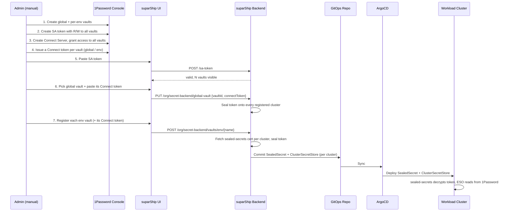

# Secrets Management

suparShip organises secrets along two axes — **scope** (where a value varies) and
**tier** (who owns it) — and materialises them at runtime with the
[External Secrets Operator](https://external-secrets.io) (ESO). The same model
works with two backends: plain Kubernetes Secrets (`k8s`) and **1Password**.

The setup is **opinionated by design** — one supported way to wire each backend.
Fewer knobs, less cognitive load, easier audits.

## The model: three scopes, two tiers

**Scopes** are the variability axis — they answer *"does this value change per
environment or per cluster?"*

| Scope | Stored in | Read by |
|---|---|---|
| `global` | the **global vault** (one) | every cluster's ESO |
| `env` | the **env vault** for that env (one per environment) | the clusters that run that env |
| `cluster` | **cluster-override items inside the env vault** (no vault of its own) | the clusters that run that env |

There are only **two kinds of vaults** — global and per-env. Cluster overrides
are per-`(env, cluster)` items inside the env vault (e.g. `web-cluster-eu-1`
inside `suparship-secrets-env-prod`), so registering or removing a cluster never
touches the vault layer. An override set for `staging`/`eu-1` does not affect
`prod`/`eu-1`.

**Tiers** are the ownership axis within each scope:

- **shared** — org-admin-owned defaults that apply to every app in the scope.
- **app** — one app's own values in that scope.

**Precedence on key collision:** `cluster > env > global` and, within a scope,
`app > shared`. ESO merges everything into one Secret per app and later entries
win, so a `cluster`/`app` value beats a `global`/`shared` one.

> **Cluster scope is a platform-engineering escape hatch** — incident
> break-glass, regional tuning, per-cluster feature kill-switches. It overrides
> every other scope and applies per `(env, cluster)` pair. Use sparingly.

### Vault, item, and store names

For the **1Password** backend a "vault" is a real 1Password vault; for the
**k8s** backend a "vault" is a namespace ESO reads Secrets from. Each vault holds
one `shared-*` item plus one `<app>-*` item per app; an **env vault additionally
holds the cluster-override items** for each cluster bound to that env.

| Thing | Pattern | Example (`app=web, env=prod, cluster=eu-1`) |
|---|---|---|
| Global vault | `suparship-secrets-global` | `suparship-secrets-global` |
| Env vault | `suparship-secrets-env-{env}` | `suparship-secrets-env-prod` |
| Shared item | `shared-{suffix}` | `shared-global`, `shared-env-prod`, `shared-cluster-eu-1` |
| App item | `{app}-{suffix}` | `web-global`, `web-env-prod`, `web-cluster-eu-1` |
| ClusterSecretStore | `suparship-store-{global\|env-{env}}` | `suparship-store-global`, `suparship-store-env-prod` |
| App K8s Secret | `{app}-secrets` | `web-secrets` |
| App ConfigMap | `{app}-config` | `web-config` |

…where item `{suffix}` is `global`, `env-{env}`, or `cluster-{cluster}`. There is
one ESO `ClusterSecretStore` per **vault** (global + one per env) — cluster items
keep their `cluster-{cluster}` suffix but are read through the **env store**,
since they live in the env vault. Example: `web-cluster-eu-1` is an item in
`suparship-secrets-env-prod`, read via `suparship-store-env-prod`.

## Two credential types (1Password)

1Password Service Accounts **cannot create vaults or issue Connect tokens** — the
operator creates both manually in the 1Password console. suparShip handles the
cluster-side automation: sealing a Connect token per scope, generating
`ClusterSecretStore`s, and publishing the manifests to GitOps.

- **Service Account (SA) token** (stored in suparShip): used to write/read/delete
  secret items in 1Password vaults — the data plane for developer secrets.
- **Connect token, one per vault** (sealed, deployed to each cluster): ESO uses
  it to read secret values at runtime. Each token is scoped to one vault and
  sealed onto the clusters whose ESO needs that vault. **Every cluster ends up
  with the global token plus the token for each env that lands on it** — the env
  token also covers the cluster-override items, since they live in the env vault.

> **Isolation note:** because Connect tokens are vault-scoped (not item-scoped),
> every cluster bound to an env can technically read all items in that env's
> vault — including sibling clusters' override items. This is an accepted
> trade-off for not having to create/register a vault per cluster.

> **Why two tokens?** 1Password Service Account tokens [cannot issue Connect
> server tokens or grant Connect servers vault access](https://1password.community/discussion/167592).
> The Connect tokens must be created manually in the 1Password web console.

## Architecture



## Admin walkthrough (1Password)

### Prerequisites

1. A **1Password account** with admin access to create vaults, Service Accounts,
   and Connect Servers.
2. **sealed-secrets** installed on each workload cluster (suparship can install
   it — see Step 4).
3. **External Secrets Operator** installed on each workload cluster (suparship
   can install it — see Step 4).
4. **1Password Connect** deployed and reachable from the workload clusters.

### Step 1: Create vaults in 1Password

Service Accounts can't create vaults, so the operator creates them by hand:

1. One **global vault** (e.g. `company-global`) — org-wide secrets, read-only
   from every cluster.
2. One **env vault** per environment (e.g. `staging-env`, `prod-env`). This
   vault also carries the per-cluster override items for that env — no
   per-cluster vault is needed.
3. A **Service Account** with Read & Write access to all of them. Copy its token.

> No vault naming convention is enforced — suparShip stores the UUID of whichever
> vault you pick/register, not its name.

### Step 2: Save the SA token

**UI:** Settings → Secrets Backend → Provider: 1Password → paste SA token → Save.
suparShip validates it and reports how many vaults are visible. The token is
stored as a K8s Secret `suparship-system/suparship-op-sa-token`.

### Step 3: Pick the global vault

**UI:** Settings → Secrets Backend → **Global vault** → "List vaults" → pick the
global vault → optionally paste its Connect token → Save.

```bash
curl -X PUT $SUPARSHIP_URL/api/v1/org/secret-backend/global-vault \
  -H "Cookie: session=…" -H "Content-Type: application/json" \
  -d '{"vaultId": "abc-123", "connectToken": "<global vault connect token>"}'
```

When a Connect token is supplied it is sealed onto **every registered cluster**
so each cluster's ESO can read the global vault.

### Step 4: Check cluster prerequisites

**UI:** Settings → Secrets Backend → Prerequisites shows green/red per component.
If sealed-secrets or ESO are missing, suparShip offers a one-click install
(pinned chart versions):

- sealed-secrets: `2.16.2` from `bitnami-labs.github.io/sealed-secrets`
- external-secrets: `0.10.7` from `charts.external-secrets.io`

### Step 5: Set up 1Password Connect

In the 1Password web console:

1. Create a **Connect Server** and grant it access to **all** suparship vaults.
2. Deploy 1Password Connect to a cluster reachable from your workloads.
3. Issue **one Connect token per vault** — global and each env.

### Step 6: Register env vaults

**UI:** Settings → Secrets Backend → **+ Add Vault** → pick the environment and
vault → paste that vault's Connect token → Submit.

```bash
curl -X POST $SUPARSHIP_URL/api/v1/org/secret-backend/vaults/env/staging \
  -d '{"vaultId": "def-456", "connectToken": "<env vault connect token>"}'
```

For each registration suparShip seals the Connect token against the relevant
clusters' sealed-secrets certs and publishes, **per cluster**, a `SealedSecret` +
`ClusterSecretStore` under `_secret-stores/{cluster}/`, driven by that cluster's
ArgoCD Application. An env vault seals onto the env's bound cluster(s). Cluster
overrides need no registration of their own — they ride along in the env vault.

### Rotating a Connect token

Re-register the same vault with a new token — suparShip re-seals and re-publishes.
Revoke the old token manually in 1Password afterward.

### Removing a vault registration

Remove it from the Secrets Backend table. The vault and its contents are
preserved in 1Password; clean up the Connect token/vault manually if no longer
needed.

## Platform-managed Secret & ConfigMap (per app)

When suparShip publishes an app it generates exactly **one** `ExternalSecret`
(→ K8s `Secret` `{app}-secrets`) and **one** `ConfigMap` (`{app}-config`) per
bound environment. These are **owned by the platform, not the app chart** — they
are written into a platform-owned GitOps tree and shipped by a platform
ApplicationSet, so application charts stay decoupled from suparShip and only need
to `envFrom` the two well-known names.

### GitOps layout

```
_app-resources/                          # platform-owned, sibling of _secret-stores/
  {env}/{project}/{app}/
    meta.yaml             # generator params: name, project, namespace
    env-configmap.yaml    # {app}-config
    external-secret.yaml  # {app}-secrets   (omitted when no scope has keys)
  previews/{project}/{preview}/
    meta.yaml             # + clusterServer for the preview's cluster
    env-configmap.yaml
    external-secret.yaml
_infra/
  {env}-platform-appset.yaml       # 1 App per app → workload cluster + {{namespace}}
  previews-platform-appset.yaml    # 1 App per preview → {{clusterServer}} + {{namespace}}
_secret-stores/{cluster}/          # per-cluster sealed Connect tokens + ClusterSecretStores
envs/{env}/{project}/{app}/        # app Application = chart + values ONLY
  app.yaml  values.yaml
```

The root app syncs the platform ApplicationSets to the control plane; ArgoCD
reconciles them into per-app Applications that sync `_app-resources/...` onto the
workload clusters in the app's namespace.

### The chart contract

App charts never define these objects — they just `envFrom` the names suparShip
passes via values (`suparship.envFromConfigMaps` = `[{app}-config]`,
`suparship.envFromSecrets` = `[{app}-secrets]`):

```yaml
# in deployment.yaml (simplified)
envFrom:
  {{- range .Values.suparship.envFromConfigMaps }}
  - configMapRef: { name: {{ . }}, optional: true }
  {{- end }}
  {{- range .Values.suparship.envFromSecrets }}
  - secretRef: { name: {{ . }}, optional: true }
  {{- end }}
```

Entries are `optional: true`, so an app pod can start before the platform
Application has populated the Secret/ConfigMap — ESO + reloader fill them in.
No sync-wave dependency is required.

### Preview environments

On preview create suparShip writes `meta.yaml`, `env-configmap.yaml`, and
`external-secret.yaml` to `_app-resources/previews/{project}/{preview}/`
(carrying the preview's `clusterServer`). The `previews-platform-appset.yaml`
ApplicationSet fans these out per preview. On preview delete the directory is
removed.

## The merged ExternalSecret

Each app namespace gets **one** `ExternalSecret` named `{app}-secrets`. Its
`dataFrom` lists every present scope/tier item in precedence order; the top-level
`secretStoreRef` is the global store, and env/cluster items carry a per-entry
`sourceRef.storeRef` to the **env store** (cluster items live in the env vault)
so a single ExternalSecret pulls from both stores into one Secret:

```yaml
apiVersion: external-secrets.io/v1
kind: ExternalSecret
metadata:
  name: web-secrets
  namespace: acme-web-prod
spec:
  refreshInterval: 1h
  secretStoreRef:
    name: suparship-store-global
    kind: ClusterSecretStore
  target:
    name: web-secrets
    creationPolicy: Owner
  dataFrom:
    - extract: { key: "shared-global" }            # global store (default)
    - extract: { key: "web-global" }               # global store (default)
    - extract: { key: "shared-env-prod" }
      sourceRef:
        storeRef: { name: suparship-store-env-prod, kind: ClusterSecretStore }
    - extract: { key: "web-env-prod" }
      sourceRef:
        storeRef: { name: suparship-store-env-prod, kind: ClusterSecretStore }
    - extract: { key: "web-cluster-eu-1" }         # wins last; env store (item lives in the env vault)
      sourceRef:
        storeRef: { name: suparship-store-env-prod, kind: ClusterSecretStore }
```

Only scopes/tiers that actually have keys get a `dataFrom` entry — computed at
publish time. Cluster items are included only when the env is bound to a cluster.

The matching per-vault `ClusterSecretStore` (1Password) points at exactly one
vault and one sealed Connect token:

```yaml
apiVersion: external-secrets.io/v1
kind: ClusterSecretStore
metadata:
  name: suparship-store-env-prod
spec:
  provider:
    onepassword:
      connectHost: http://onepassword-connect.onepassword-connect.svc.cluster.local:8080
      vaults:
        <env-prod vault UUID>: 1
      auth:
        secretRef:
          connectTokenSecretRef:
            name: op-connect-token-env-prod
            key: token
            namespace: external-secrets
```

For the **k8s** backend the store reads a namespace instead, via the
`suparship-eso-reader` ServiceAccount in `suparship-system`:

```yaml
spec:
  provider:
    kubernetes:
      remoteNamespace: suparship-secrets-env-prod
      auth:
        serviceAccount:
          name: suparship-eso-reader
          namespace: suparship-system
```

## Populating secrets

After app creation:

1. Open the vault that backs the scope you want — the global vault, or the env
   vault (which also holds that env's cluster-override items).
2. Find the item suparShip created (`shared-*` for org-admin defaults,
   `{app}-*` for an app).
3. Replace the `_placeholder` field with real `KEY = value` pairs.

ESO syncs to the K8s Secret within the `refreshInterval` (default `1h`). Force an
immediate sync:

```bash
kubectl annotate externalsecret <app>-secrets \
  suparship.io/forced-sync-at="$(date -u +%Y-%m-%dT%H:%M:%SZ)" \
  -n <namespace> --overwrite
```

The UI Save button does this for you via
`POST /api/v1/projects/:project/apps/:app/secrets/sync`.

## Where to write each scope/tier (UI + API)

| Scope | Tier | UI | API |
|---|---|---|---|
| global | shared | Org Settings → Secrets | `…/org/secrets/global` |
| global | app | App → Secrets → Global | `…/projects/{p}/apps/{a}/secrets/global` |
| env | shared | Org Settings → Secrets (env) | `…/org/secrets/env/{env}` |
| env | app | App → Secrets → Env | `…/projects/{p}/apps/{a}/secrets/env/{env}` |
| cluster | shared | Cluster Settings → Overrides (per env) | `…/org/secrets/env/{env}/cluster/{cluster}` |
| cluster | app | App → Secrets → Env → Cluster | `…/projects/{p}/apps/{a}/secrets/env/{env}/cluster/{cluster}` |

## RBAC matrix

| Operation | Required role |
|---|---|
| global / env / cluster **shared** writes | `org_admin` |
| app-tier writes (any scope) | `developer` (or higher) for the project |
| Backend setup, SA token, vault registration | `org_admin` |

All scopes are readable by any authenticated user (`viewer` and above).

## Security guarantees

| Risk | Mitigation |
|---|---|
| SA token blast radius | suparShip validates vault count on paste; scope the SA to suparship vaults only. |
| SA token leak from cluster | K8s Secret restricted via RBAC to the suparship controller ServiceAccount. |
| Per-vault credential blast radius | One Connect token per vault; a cluster only carries tokens for the vaults it reads (global + its envs). Clusters sharing an env vault can read each other's override items — accepted trade-off. |
| Connect token in Git | Always sealed before commit; plaintext never crosses the suparship process boundary except during in-memory seal. |
| Token rotation | Re-register with a new token; revoke the old one manually in 1Password. |
| Audit trail | Every write/delete and vault registration is logged with actor, scope, vault, and result. |

Key names and outcomes are logged; **secret values, SA tokens, and Connect
tokens are never logged.**

## Install-time conventions

These are intentionally not configurable — they keep every install identical and
easy to audit.

| Symbol | Value |
|---|---|
| SA token K8s Secret | `suparship-op-sa-token` in `suparship-system` |
| Connect token secret pattern | `op-connect-token-{global\|env-{env}}` |
| ClusterSecretStore pattern | `suparship-store-{global\|env-{env}}` |
| Remote namespace (ESO resources) | `external-secrets` |
| Connect endpoint | `http://onepassword-connect.onepassword-connect.svc.cluster.local:8080` |
| k8s ESO reader | ServiceAccount `suparship-eso-reader` (cluster-wide Secret read) |

## Troubleshooting

### App pods don't see global keys

The cluster's ESO is missing the global Connect token, or the token can't read
the global vault. Confirm a global vault + token are set (Step 3), that the token
was sealed onto this cluster (`_secret-stores/{cluster}/`), and force a re-sync.

### `gitops: skipping publish for unbound env`

The env has no `ClusterRef`, or the referenced cluster isn't registered. The
publisher writes nothing for unbound envs. Fix in Settings → Environments →
assign a cluster, then "Sync to Git" on the app.

### "Resolved Secrets" shows keys but they don't reach the workload

Most likely the `ExternalSecret` was generated before a scope's vault/token was
registered. Re-publish:
`POST /api/v1/projects/{project}/apps/{app}/sync` — the publisher rebuilds the
merged ExternalSecret from the current vault registrations.

### Cluster-scope keys don't reach the workload

Cluster-override items live in the **env vault**, so the env vault must be
registered with a Connect token (Step 6) and `_secret-stores/{cluster}/` must
carry `store-env-{env}.yaml` + `sealed-token-env-{env}.yaml` for the env the app
runs in. Also confirm the override was written for the right `(env, cluster)`
pair — an override for `staging`/`eu-1` does not apply to `prod`/`eu-1`.

## Keep going without suparship

The GitOps repository is fully self-contained:

- `_secret-stores/{cluster}/sealed-token-{suffix}.yaml` — sealed Connect token
- `_secret-stores/{cluster}/store-{suffix}.yaml` — `ClusterSecretStore`
- `_app-resources/{env}/{project}/{app}/external-secret.yaml` — `ExternalSecret`
- `_app-resources/{env}/{project}/{app}/env-configmap.yaml` — `ConfigMap`

Anyone can `kubectl apply` these (or let ArgoCD do it) without ever running
suparship. suparship is the control plane for the **inputs** (vault items,
generated CRs in Git); the runtime is plain ESO + sealed-secrets + ArgoCD.

## Out of scope (this iteration)

- Sealing-cert rotation / re-sealing on cert change.
- HashiCorp Vault and AWS-SM `VaultStore` implementations.
- Binary / file secrets (TLS certs, kubeconfigs) — UI accepts only UTF-8
  `KEY=value`, ≤64 KiB.
- Per-PR preview vaults — previews resolve secrets from the env/global scopes.
- Vault-side cleanup on registration removal — items remain in 1Password for the
  admin to clean up.
- Automated Connect token issuance (blocked by 1Password SA token limitations).
