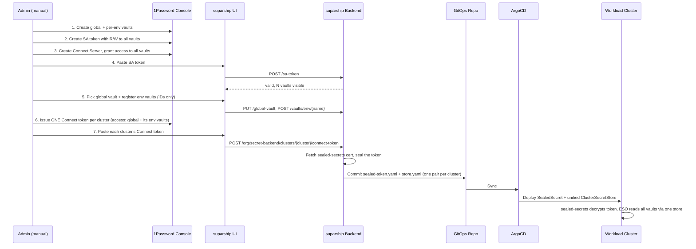

# Secrets Management

suparship organises secrets along two axes — **scope** (where a value varies) and
**tier** (who owns it) — and materialises them at runtime with the
[External Secrets Operator](https://external-secrets.io) (ESO). The same model
works with three backends: **HashiCorp Vault** (`vault`, the recommended
open-source backend), **1Password** (`onepassword`), and plain Kubernetes
Secrets (`k8s`, deprecated — see below).

The setup is **opinionated by design** — one supported way to wire each backend.
Fewer knobs, less cognitive load, easier audits.

> **The `k8s` backend is deprecated — demo/dev only.** Its "vaults" are
> namespaces on the **tooling cluster**, and its ClusterSecretStores sync only
> there — so on any *remote* workload cluster, app ExternalSecrets reference a
> store that never arrives and sit NotReady forever. It keeps working for
> single-cluster installs and stays selectable where already configured, but
> new installs should use Vault or 1Password. Move off it with
> `suparship secrets migrate --from k8s --to vault` (see
> [Migrating between backends](#migrating-between-backends)).

## The model: three scopes, two tiers

**Scopes** are the variability axis — they answer *"does this value change per
environment or per cluster?"*

| Scope | Stored in | Read by |
|---|---|---|
| `global` | the **global vault** (one) | every cluster's ESO |
| `env` | the **env vault** for that env (one per environment) | the clusters that run that env |
| `cluster` | **cluster-override items inside the env vault** (no vault of its own) | the clusters that run that env |

There are only **two kinds of vaults** — global and per-env. Cluster overrides
are per-`(env, cluster)` items inside the env vault (e.g. `web-cluster-eu-1`
inside `suparship-secrets-env-prod`), so registering or removing a cluster never
touches the vault layer. An override set for `staging`/`eu-1` does not affect
`prod`/`eu-1`.

**Tiers** are the ownership axis within each scope:

- **shared** — org-admin-owned defaults that apply to every app in the scope.
- **app** — one app's own values in that scope.

**Precedence on key collision:** `cluster > env > global` and, within a scope,
`app > shared`. ESO merges everything into one Secret per app and later entries
win, so a `cluster`/`app` value beats a `global`/`shared` one.

> **Cluster scope is a platform-engineering escape hatch** — incident
> break-glass, regional tuning, per-cluster feature kill-switches. It overrides
> every other scope and applies per `(env, cluster)` pair. Use sparingly.

**Previews** reuse the same mechanism: a preview reads a per-app
`<app>-env-preview` band (and an optional per-PR `<app>-env-preview-pr-<name>`)
item **inside the base env's vault** — no per-preview vault is created. See
[previews.md](previews.md).

### Vault, item, and store names

For the **1Password** backend a "vault" is a real 1Password vault; for the
**k8s** backend a "vault" is a namespace ESO reads Secrets from. Each vault holds
one `shared-*` item plus one `<app>-*` item per app; an **env vault additionally
holds the cluster-override items** for each cluster bound to that env.

| Thing | Pattern | Example (`app=web, env=prod, cluster=eu-1`) |
|---|---|---|
| Global vault | `suparship-secrets-global` | `suparship-secrets-global` |
| Env vault | `suparship-secrets-env-{env}` | `suparship-secrets-env-prod` |
| Shared item | `shared-{suffix}` | `shared-global`, `shared-env-prod`, `shared-cluster-eu-1` |
| App item | `{app}-{suffix}` | `web-global`, `web-env-prod`, `web-cluster-eu-1` |
| ClusterSecretStore (1Password, one per cluster) | `suparship-store` | `suparship-store` |
| ClusterSecretStore (k8s, one per vault) | `suparship-store-{global\|env-{env}}` | `suparship-store-global`, `suparship-store-env-prod` |
| Connect token Secret (1Password, one per cluster) | `op-connect-token` | `op-connect-token` |
| App K8s Secret | `{app}-secrets` | `web-secrets` |
| App ConfigMap | `{app}-config` | `web-config` |

…where item `{suffix}` is `global`, `env-{env}`, or `cluster-{cluster}`.

**One store, one token per cluster (1Password).** An `ExternalSecret` works best
against a single store, and ESO's 1Password provider can list **multiple vaults
in one `ClusterSecretStore`** — so every workload cluster runs exactly one store,
named `suparship-store` on every cluster, whose `vaults:` map lists the global
vault plus the env vault(s) of the environments bound to that cluster. Cluster
items keep their `cluster-{cluster}` suffix and resolve through that same store
(item names are scope-unique, so multi-vault lookup is unambiguous). Because the
store name is identical everywhere, app `ExternalSecret`s are cluster-agnostic —
rebinding an env to a different cluster needs no regeneration.

The **k8s** backend keeps one store per vault/namespace
(`suparship-store-{global|env-{env}}`) — ESO's `kubernetes` provider reads
exactly one `remoteNamespace` per store.

## HashiCorp Vault backend

For the **Vault** backend, a suparship "vault" is a **path prefix inside one
KV v2 mount** (default mount: `suparship`) and an item is the KV entry beneath
it:

| Thing | Vault path (`mount=suparship, app=web, project=acme, env=prod`) |
|---|---|
| Global vault | `suparship/suparship-secrets-global/` |
| Env vault | `suparship/suparship-secrets-env-prod/` |
| Shared item | `suparship/suparship-secrets-global/shared-global` |
| App item | `suparship/suparship-secrets-env-prod/acme-web-env-prod` |
| ClusterSecretStore (one per cluster) | `suparship-store` |
| ESO token Secret (per cluster) | `vault-token` in `external-secrets` |

Because the containers are **derived paths**, there is no per-scope
registration step — no global-vault pick, no env-vault registration. Generated
`ExternalSecret`s reference items by full path
(`dataFrom.extract.key: "suparship-secrets-env-prod/acme-web-env-prod"`), and
every cluster runs one `ClusterSecretStore` with the same fixed name, so app
ExternalSecrets stay cluster-agnostic — exactly the 1Password unified-store
model with a different provider stanza.

### Two credential types (Vault)

- **Write token** (stored in suparship as K8s Secret `suparship-vault-token`):
  used by suparship itself to create/update/read/delete items under the mount —
  the data plane for developer secrets. Paste it in Settings → Secrets Backend;
  pasting also probes the connection.
- **Read token, one per cluster** (sealed, delivered via GitOps): that
  cluster's ESO authenticates with it to pull values. Needs read on the mount
  only. Pasted per cluster in the UI; suparship seals it against the cluster's
  sealed-secrets cert and publishes the sealed token + `ClusterSecretStore`
  through the same per-cluster pipeline the 1Password backend uses — so it
  reaches **remote workload clusters** correctly.

### Admin walkthrough (Vault)

1. **Enable a KV v2 mount** on your Vault: `vault secrets enable -path=suparship -version=2 kv`.
2. **Write the policies.** Because a suparship vault is a *path prefix*, a
   path-scoped policy is the thing that actually isolates one environment's
   secrets from another's — see [Least privilege](#least-privilege-vault) below
   for why this matters and how it's enforced. suparship renders the exact set
   for your mount and environments under **Settings → Secrets Backend → Vault
   policies**, or via `GET /api/v1/org/secret-backend/vault-policies`. KV v2
   routes values through `data/` and listings + item deletion through
   `metadata/`, so both prefixes appear in each policy.

   ```bash
   # suparship's own write policy — mount-wide ON PURPOSE: suparship is the
   # control plane that creates and rotates items in every scope.
   vault policy write suparship-write - <<'EOF'
   path "suparship/data/*"     { capabilities = ["create", "update", "read", "delete"] }
   path "suparship/metadata/*" { capabilities = ["read", "list", "delete"] }
   EOF

   # ESO read policies — ONE PER SCOPE PREFIX, never mount-wide.
   vault policy write suparship-eso-read-global - <<'EOF'
   path "suparship/data/suparship-secrets-global/*"     { capabilities = ["read"] }
   path "suparship/metadata/suparship-secrets-global/*" { capabilities = ["read", "list"] }
   EOF

   # ...and one like this for each environment (staging shown):
   vault policy write suparship-eso-read-env-staging - <<'EOF'
   path "suparship/data/suparship-secrets-env-staging/*"     { capabilities = ["read"] }
   path "suparship/metadata/suparship-secrets-env-staging/*" { capabilities = ["read", "list"] }
   EOF
   ```

3. **Mint the tokens.** One write token for suparship, then one read token per
   workload cluster carrying only the scopes that cluster is entitled to —
   Vault policies are additive, so entitlement is *which policies the token
   carries*:

   ```bash
   vault token create -policy=suparship-write -orphan \
     -display-name=suparship-server -ttl=2160h

   # a cluster bound to staging only:
   vault token create -orphan \
     -policy=suparship-eso-read-global \
     -policy=suparship-eso-read-env-staging \
     -display-name=suparship-eso-<cluster> -ttl=2160h
   ```

   The UI prints this command per cluster, with the policy flags already
   matching that cluster's environment bindings.

   `-orphan` so a token doesn't die with the operator token that minted it;
   per-cluster display names keep audits and revocation per-cluster. Use a
   plain TTL and rotate by re-pasting before expiry — **not** `-period`
   tokens, which expire unless actively renewed and nothing in this pipeline
   renews them. Leave Vault's `default` policy attached: suparship's connection
   probe is a token self-lookup, which `default` grants. (In the `task up`
   dev loop both tokens are simply Vault's generated root token, stashed in
   `vault/vault-dev-keys` — convenient, and deliberately not least-privilege.)
4. **Settings → Secrets Backend → HashiCorp Vault**: enter the server address
   (reachable from the tooling cluster AND every workload cluster) and the
   mount; save.
5. **Paste the write token** — suparship stores and probes it.
6. **Per cluster: paste its read token** — suparship seals and publishes that
   cluster's `ClusterSecretStore`. Rotation is a re-paste, same as 1Password
   Connect tokens; revoke the old token in Vault afterwards.

Vault Enterprise namespaces and a private CA bundle are supported via the same
settings panel (`secrets.vault.namespace` / `secrets.vault.caCert` in Helm
values).

### Least privilege (Vault)

One KV mount for every environment is fine — a Vault path prefix is a real
isolation boundary, and nothing about SOC 2 requires a separate secret engine per
environment. What matters is that **policy** enforces the boundary. Granting each
cluster `read` on `{mount}/data/*` would not: every workload cluster's ESO token
could then read production, and anyone able to read the `vault-token` Secret in a
staging cluster's `external-secrets` namespace would have prod secrets. That is a
least-privilege / prod-vs-non-prod segregation finding, and it is the one thing
this layout has to get right.

So read policies are **per scope prefix**, and a cluster's token composes the ones
it is entitled to:

| Policy | Grants read on | Who carries it |
|---|---|---|
| `suparship-write` | the whole mount | suparship itself (control plane) |
| `suparship-eso-read-global` | `{mount}/…-secrets-global/*` | every cluster |
| `suparship-eso-read-env-<env>` | `{mount}/…-secrets-env-<env>/*` | clusters bound to `<env>` |

Per scope rather than per cluster because Vault policies are additive: an
environment's policy is written once and never changes as clusters are added,
removed, or failed over — only the token's policy list does. Entitlement follows
the same binding rule the 1Password backend uses for Connect tokens
(`clusterVaultIDs`): the global prefix plus every environment **bound** to that
cluster, not just the active one, so a standby resolves secrets across a failover.

Two prefix families is complete coverage. `VaultName` maps every scope onto one of
them, so cluster overrides, project-env, stack-env, and preview items all live
under their environment's prefix and need no grant of their own.

suparship computes the set but never applies it: its write token covers the KV
mount, not the `sys/policy` and token-create rights these need. Get the current
set from **Settings → Secrets Backend** or
`GET /api/v1/org/secret-backend/vault-policies`.

**Re-run the per-cluster token command after changing an environment's cluster
bindings.** Binding a new env to a cluster does not widen its existing token —
ESO will fail to resolve the new env's items until the token is re-minted with
that env's policy and re-pasted. That is the intended direction of failure: a
missing grant breaks a lookup loudly, where an over-broad one stays silent.

### Audit and rotation (Vault)

Two things the policies above don't cover, both worth settling before an audit:

- **Enable a Vault audit device** (`vault audit enable file
  file_path=/vault/logs/audit.log`, or `socket`). suparship's own audit trail
  (`internal/secrets/audit.go`) records the mutations *it* performs — actor,
  scope, key names, never values — but it cannot see ESO's reads or anything done
  out-of-band with a token. Vault's audit device is where read evidence lives.
- **These are static tokens.** Rotation is a re-paste, and `-orphan` means an
  operator's departure does not revoke them — put the per-cluster tokens in your
  access-review procedure. Kubernetes/JWT auth for ESO→Vault is the real fix and
  is still open (see [Out of scope](#out-of-scope-this-iteration)).

## Migrating between backends

`suparship secrets migrate` copies every item the org owns — shared and app
tier, across all scopes — from one backend's storage into another's:

```bash
suparship secrets migrate --from k8s --to vault --dry-run   # review first
suparship secrets migrate --from k8s --to vault
```

Additive and idempotent: the source is never modified, the destination is
merged into, and a re-run converges. Values stay inside the CLI process; only
item names and counts are printed. Per-PR preview overrides are not migrated
(transient, re-created by CI on the next push).

Rollout: migrate → switch the backend (Settings → Secrets Backend or
`suparship secrets backend set --type=vault`; takes effect without a restart) →
verify apps' ExternalSecrets are Ready → clean up the source backend by hand.
Switching back at any point loses nothing — every backend's configuration is
retained across switches.

## Two credential types (1Password)

1Password Service Accounts **cannot create vaults or issue Connect tokens** — the
operator creates both manually in the 1Password console. suparship handles the
cluster-side automation: sealing each cluster's Connect token, generating its
unified `ClusterSecretStore`, and publishing the manifests to GitOps.

- **Service Account (SA) token** (stored in suparship): used to write/read/delete
  secret items in 1Password vaults — the data plane for developer secrets.
- **Connect token, one per cluster** (sealed, deployed to that cluster): ESO uses
  it to read secret values at runtime. Each cluster's token is granted access to
  **every vault that cluster reads** — the global vault plus the env vaults of
  the environments bound to it.

> **Isolation note:** Connect tokens are vault-scoped (not item-scoped), so every
> cluster bound to an env can technically read all items in that env's vault —
> including sibling clusters' override items. This is an accepted trade-off for
> not having to create/register a vault per cluster.

> **Binding changes need a token re-issue.** A cluster's token must cover its
> vault set. When you bind a *new* env to a cluster, issue a new Connect token in
> the 1Password console that also covers the new env vault, and re-paste it for
> that cluster — suparship re-seals and republishes the store. (Registering a new
> env vault or changing bindings already republishes the store automatically; only
> the token's vault access needs the manual step.)

> **Why two tokens?** 1Password Service Account tokens [cannot issue Connect
> server tokens or grant Connect servers vault access](https://1password.community/discussion/167592).
> The Connect tokens must be created manually in the 1Password web console.

## Architecture



## Admin walkthrough (1Password)

### Prerequisites

1. A **1Password account** with admin access to create vaults, Service Accounts,
   and Connect Servers.
2. **sealed-secrets** installed on each workload cluster (suparship can install
   it — see Step 4).
3. **External Secrets Operator** installed on each workload cluster (suparship
   can install it — see Step 4).
4. **1Password Connect** deployed and reachable from the workload clusters.

### Step 1: Create vaults in 1Password

Service Accounts can't create vaults, so the operator creates them by hand:

1. One **global vault** (e.g. `company-global`) — org-wide secrets, read-only
   from every cluster.
2. One **env vault** per environment (e.g. `staging-env`, `prod-env`). This
   vault also carries the per-cluster override items for that env — no
   per-cluster vault is needed.
3. A **Service Account** with Read & Write access to all of them. Copy its token.

> No vault naming convention is enforced — suparship stores the UUID of whichever
> vault you pick/register, not its name.

### Step 2: Save the SA token

**UI:** Settings → Secrets Backend → Provider: 1Password → paste SA token → Save.
suparship validates it and reports how many vaults are visible. The token is
stored as a K8s Secret `suparship-system/suparship-op-sa-token`.

### Step 3: Register vaults (IDs only)

**UI:** Settings → Secrets Backend → **Global vault** → "List vaults" → pick the
global vault → Save. Then **+ Add Vault** → pick each environment and its vault.

```bash
curl -X PUT $SUPARSHIP_URL/api/v1/org/secret-backend/global-vault \
  -H "Cookie: session=…" -H "Content-Type: application/json" \
  -d '{"vaultId": "abc-123"}'
curl -X POST $SUPARSHIP_URL/api/v1/org/secret-backend/vaults/env/staging \
  -d '{"vaultId": "def-456"}'
```

Registration only records which vault backs each scope — no tokens here. Cluster
overrides need no registration of their own; they ride along in the env vault.

### Step 4: Check cluster prerequisites

**UI:** Settings → Secrets Backend → Prerequisites shows green/red per component.
If sealed-secrets or ESO are missing, suparship offers a one-click install
(pinned chart versions):

- sealed-secrets: `2.16.2` from `bitnami-labs.github.io/sealed-secrets`
- external-secrets: `0.10.7` from `charts.external-secrets.io`

### Step 5: Set up 1Password Connect

In the 1Password web console:

1. Create a **Connect Server** and grant it access to **all** suparship vaults.
2. Deploy 1Password Connect to a cluster reachable from your workloads.
3. Issue **one Connect token per cluster**, granting it access to the global
   vault plus the env vaults of the environments bound to that cluster.

### Step 6: Paste each cluster's Connect token

**UI:** Settings → Secrets Backend → **Cluster Connect Tokens** → paste the
cluster's token → Seal.

```bash
curl -X POST $SUPARSHIP_URL/api/v1/org/secret-backend/clusters/prod-eu/connect-token \
  -d '{"connectToken": "<that cluster's connect token>"}'
```

suparship stashes the token, seals it against the cluster's sealed-secrets cert,
and publishes exactly two files under `_secret-stores/{cluster}/` —
`sealed-token.yaml` (Secret `op-connect-token`) and `store.yaml` (the unified
`suparship-store` listing every vault the cluster reads) — synced by that
cluster's ArgoCD Application. Registering vaults or changing env bindings later
republishes the store automatically using the stashed token.

### Rotating a Connect token

Re-paste a new token for the cluster — suparship re-stashes, re-seals, and
re-publishes. Revoke the old token manually in 1Password afterward. The same
flow covers widening access when a new env is bound to the cluster.

### Removing a vault registration

Remove it from the Secrets Backend table. The vault and its contents are
preserved in 1Password; clean up the Connect token/vault manually if no longer
needed.

## Platform-managed Secret & ConfigMap (per app)

When suparship publishes an app it generates exactly **one** `ExternalSecret`
(→ K8s `Secret` `{app}-secrets`) and **one** `ConfigMap` (`{app}-config`) per
bound environment. These are **owned by the platform, not the app chart** — they
are written into a platform-owned GitOps tree and shipped by a platform
ApplicationSet, so application charts stay decoupled from suparship and only need
to `envFrom` the two well-known names.

### GitOps layout

```
_app-resources/                          # platform-owned, sibling of _secret-stores/
  {env}/{project}/{app}/
    meta.yaml             # generator params: name, project, namespace
    env-configmap.yaml    # {app}-config
    external-secret.yaml  # {app}-secrets   (omitted when no scope has keys)
  previews/{project}/{preview}/
    meta.yaml             # + clusterServer for the preview's cluster
    env-configmap.yaml
    external-secret.yaml
_infra/
  {env}-platform-appset.yaml       # 1 App per app → workload cluster + {{namespace}}
  previews-platform-appset.yaml    # 1 App per preview → {{clusterServer}} + {{namespace}}
_secret-stores/{cluster}/          # per-cluster sealed-token.yaml + store.yaml (one token, one unified store)
envs/{env}/{project}/{app}/        # app Application = chart + values ONLY
  app.yaml  values.yaml
```

The root app syncs the platform ApplicationSets to the control plane; ArgoCD
reconciles them into per-app Applications that sync `_app-resources/...` onto the
workload clusters in the app's namespace.

### The chart contract

App charts never define these objects — they just `envFrom` the names suparship
passes via values (`suparship.envFromConfigMaps` = `[{app}-config]`,
`suparship.envFromSecrets` = `[{app}-secrets]`):

```yaml
# in deployment.yaml (simplified)
envFrom:
  {{- range .Values.suparship.envFromConfigMaps }}
  - configMapRef: { name: {{ . }}, optional: true }
  {{- end }}
  {{- range .Values.suparship.envFromSecrets }}
  - secretRef: { name: {{ . }}, optional: true }
  {{- end }}
```

Entries are `optional: true`, so an app pod can start before the platform
Application has populated the Secret/ConfigMap — ESO + reloader fill them in.
No sync-wave dependency is required.

### Preview environments

On preview create suparship writes `meta.yaml`, `env-configmap.yaml`, and
`external-secret.yaml` to `_app-resources/previews/{project}/{preview}/`
(carrying the preview's `clusterServer`). The `previews-platform-appset.yaml`
ApplicationSet fans these out per preview. On preview delete the directory is
removed.

## The merged ExternalSecret

Each app namespace gets **one** `ExternalSecret` named `{app}-secrets`. Its
`dataFrom` lists every present scope/tier item in precedence order. On the
**1Password** backend every item extracts from the cluster's single unified
store, so no per-entry `sourceRef` is needed:

```yaml
apiVersion: external-secrets.io/v1
kind: ExternalSecret
metadata:
  name: web-secrets
  namespace: acme-web-prod
spec:
  refreshInterval: 1h
  secretStoreRef:
    name: suparship-store          # the cluster's one unified store
    kind: ClusterSecretStore
  target:
    name: web-secrets
    creationPolicy: Owner
  dataFrom:
    - extract: { key: "shared-global" }       # global vault
    - extract: { key: "web-global" }          # global vault
    - extract: { key: "shared-env-prod" }     # env vault
    - extract: { key: "web-env-prod" }        # env vault
    - extract: { key: "web-cluster-eu-1" }    # env vault (cluster override); wins last
```

Only scopes/tiers that actually have keys get a `dataFrom` entry — computed at
publish time. Cluster items are included only when the env is bound to a cluster.
Item names are scope-unique, so the multi-vault lookup is unambiguous.

The cluster's unified `ClusterSecretStore` (1Password) lists every vault the
cluster reads and references its one sealed Connect token:

```yaml
apiVersion: external-secrets.io/v1
kind: ClusterSecretStore
metadata:
  name: suparship-store
spec:
  provider:
    onepassword:
      connectHost: http://onepassword-connect.onepassword-connect.svc.cluster.local:8080
      vaults:
        <global vault UUID>: 1
        <env-prod vault UUID>: 2
      auth:
        secretRef:
          connectTokenSecretRef:
            name: op-connect-token
            key: token
            namespace: external-secrets
```

For the **k8s** backend a store reads exactly one namespace via the
`suparship-eso-reader` ServiceAccount in `suparship-system`, so there is one
store per vault/namespace and the ExternalSecret carries per-entry
`sourceRef.storeRef`s instead:

```yaml
spec:
  provider:
    kubernetes:
      remoteNamespace: suparship-secrets-env-prod
      auth:
        serviceAccount:
          name: suparship-eso-reader
          namespace: suparship-system
```

## Populating secrets

After app creation:

1. Open the vault that backs the scope you want — the global vault, or the env
   vault (which also holds that env's cluster-override items).
2. Find the item suparship created (`shared-*` for org-admin defaults,
   `{app}-*` for an app).
3. Replace the `_placeholder` field with real `KEY = value` pairs.

ESO syncs to the K8s Secret within the `refreshInterval` (default `1h`). Force an
immediate sync:

```bash
kubectl annotate externalsecret <app>-secrets \
  suparship.io/forced-sync-at="$(date -u +%Y-%m-%dT%H:%M:%SZ)" \
  -n <namespace> --overwrite
```

The UI Save button does this for you via
`POST /api/v1/projects/:project/apps/:app/secrets/sync`.

## Where to write each scope/tier (UI + API)

| Scope | Tier | UI | API |
|---|---|---|---|
| global | shared | Org Settings → Secrets | `…/org/secrets/global` |
| global | app | App → Secrets → Global | `…/projects/{p}/apps/{a}/secrets/global` |
| env | shared | Org Settings → Secrets (env) | `…/org/secrets/env/{env}` |
| env | app | App → Secrets → Env | `…/projects/{p}/apps/{a}/secrets/env/{env}` |
| cluster | shared | Cluster Settings → Overrides (per env) | `…/org/secrets/env/{env}/cluster/{cluster}` |
| cluster | app | App → Secrets → Env → Cluster | `…/projects/{p}/apps/{a}/secrets/env/{env}/cluster/{cluster}` |

## RBAC matrix

| Operation | Required role |
|---|---|
| global / env / cluster **shared** writes | `org_admin` |
| app-tier writes (any scope) | `developer` (or higher) for the project |
| Backend setup, SA token, vault registration | `org_admin` |

All scopes are readable by any authenticated user (`viewer` and above).

## Security guarantees

| Risk | Mitigation |
|---|---|
| SA token blast radius | suparship validates vault count on paste; scope the SA to suparship vaults only. |
| SA token leak from cluster | K8s Secret restricted via RBAC to the suparship controller ServiceAccount. |
| Per-cluster credential blast radius | One Connect token per cluster, granted access only to the vaults that cluster reads (global + its envs). Clusters sharing an env vault can read each other's override items — accepted trade-off. |
| Connect token in Git | Always sealed before commit; plaintext never crosses the suparship process boundary except during in-memory seal (a stash copy lives in `suparship-system` for re-seals). |
| Token rotation | Re-paste the cluster's token; revoke the old one manually in 1Password. |
| Audit trail | Every write/delete and vault registration is logged with actor, scope, vault, and result. |

Key names and outcomes are logged; **secret values, SA tokens, and Connect
tokens are never logged.**

## Install-time conventions

These are intentionally not configurable — they keep every install identical and
easy to audit.

| Symbol | Value |
|---|---|
| SA token K8s Secret | `suparship-op-sa-token` in `suparship-system` |
| Connect token secret (per cluster) | `op-connect-token` |
| Connect token stash (per cluster) | `suparship-onepassword-connect-token-cluster-{cluster}` in `suparship-system` |
| ClusterSecretStore (1Password, per cluster) | `suparship-store` |
| ClusterSecretStore (k8s, per vault) | `suparship-store-{global\|env-{env}}` |
| Remote namespace (ESO resources) | `external-secrets` |
| Connect endpoint | `http://onepassword-connect.onepassword-connect.svc.cluster.local:8080` |
| k8s ESO reader | ServiceAccount `suparship-eso-reader` (cluster-wide Secret read) |

## Troubleshooting

### "Secrets aren't getting saved in Vault" / saving returns an error

If a save **fails** with *backend is set to "vault" but …; refusing the write*,
that is deliberate. The selected backend could not be built, and rather than
storing the value in Kubernetes instead — which would return 200, read back
correctly, and leave Vault empty — the write is refused. Check
`GET /api/v1/credentials/health` (the `vault` entry names the cause) or:

```bash
kubectl logs -n suparship-system deploy/suparship | grep "selected secrets backend unavailable"
kubectl get secret suparship-vault-token -n suparship-system   # the WRITE token
```

The four causes: no server address, no write token, the client failed to build
(bad CA bundle / unparseable address), or a missing `vault` config block.

Note the **write token is a separate credential from the per-cluster read
tokens**. The write token goes in Settings → Secrets Backend and is what suparship
itself writes with; the per-cluster ones go in *Cluster Vault Tokens* and are what
each cluster's ESO reads with. Pasting only the per-cluster tokens leaves every
write refused.

Reads deliberately still fall back to the previous backend, so an operator
mid-migration can see what the old one holds. Only writes fail closed.

**On builds before this behaviour existed**, the same conditions silently
redirected writes to the Kubernetes store. If secrets appeared to save but Vault
was empty, they are in the `suparship-secrets-*` namespaces — recover them with
`suparship secrets migrate --from k8s --to vault`.

### App pods don't see global keys

The cluster's Connect token is missing or can't read the global vault. Confirm
the global vault is registered (Step 3), the cluster's token is sealed
(`_secret-stores/{cluster}/sealed-token.yaml` exists and the Cluster Connect
Tokens card shows "sealed"), the token's vault access includes the global vault,
and force a re-sync.

### `gitops: skipping publish for unbound env`

The env has no `ClusterRef`, or the referenced cluster isn't registered. The
publisher writes nothing for unbound envs. Fix in Settings → Environments →
assign a cluster, then "Sync to Git" on the app.

### "Resolved Secrets" shows keys but they don't reach the workload

Most likely the `ExternalSecret` was generated before a scope's vault/token was
registered. Re-publish:
`POST /api/v1/projects/{project}/apps/{app}/sync` — the publisher rebuilds the
merged ExternalSecret from the current vault registrations.

### Env- or cluster-scope keys don't reach the workload

Cluster-override items live in the **env vault**. Confirm the env vault is
registered (Step 3), the cluster's `store.yaml` lists that vault's UUID (it is
republished automatically on registration/binding changes when a token is
stashed), and the cluster's Connect token has access to the env vault — binding
a new env to a cluster requires re-issuing + re-pasting the token. Also confirm
the override was written for the right `(env, cluster)` pair — an override for
`staging`/`eu-1` does not apply to `prod`/`eu-1`.

## Keep going without suparship

The GitOps repository is fully self-contained:

- `_secret-stores/{cluster}/sealed-token.yaml` — the cluster's sealed Connect token
- `_secret-stores/{cluster}/store.yaml` — the cluster's unified `ClusterSecretStore`
- `_app-resources/{env}/{project}/{app}/external-secret.yaml` — `ExternalSecret`
- `_app-resources/{env}/{project}/{app}/env-configmap.yaml` — `ConfigMap`

Anyone can `kubectl apply` these (or let ArgoCD do it) without ever running
suparship. suparship is the control plane for the **inputs** (vault items,
generated CRs in Git); the runtime is plain ESO + sealed-secrets + ArgoCD.

## Out of scope (this iteration)

- Sealing-cert rotation / re-sealing on cert change.
- AWS-SM `VaultStore` implementation.
- Kubernetes/JWT auth for ESO→Vault (the sealed per-cluster token reuses the
  proven pipeline; revisit once Vault is field-proven).
- Binary / file secrets (TLS certs, kubeconfigs) — UI accepts only UTF-8
  `KEY=value`, ≤64 KiB.
- Per-PR preview vaults — previews resolve secrets from the env/global scopes.
- Vault-side cleanup on registration removal — items remain in 1Password for the
  admin to clean up.
- Automated Connect token issuance (blocked by 1Password SA token limitations).
