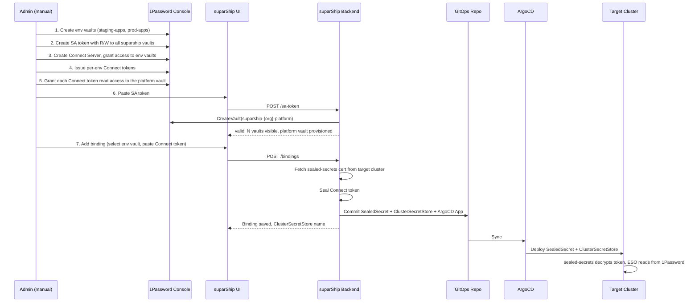
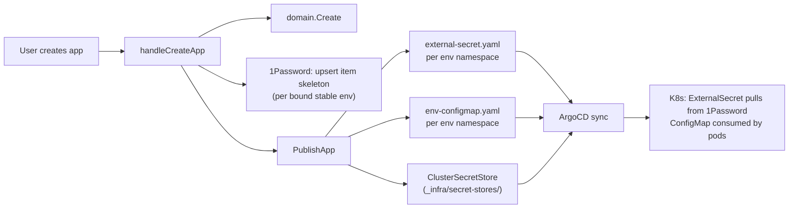

# Secrets Management

suparShip provides a six-level secret hierarchy (org → environment-type → project → app → app-environment → cluster) with values stored in **1Password** and materialised at runtime by the [External Secrets Operator](https://external-secrets.io) (ESO).

The setup is **opinionated by design** — there is one supported way to wire 1Password into suparship. Fewer knobs, less cognitive load, easier audits.

## TL;DR

- Two credential types: a **Service Account (SA) token** for suparShip to write secrets, and **per-env Connect tokens** for ESO to read them.
- Paste the SA token → suparShip auto-creates a **platform-shared vault** for org / project items.
- **Add Binding** per environment (pick env vault, paste Connect token). Grant the Connect token read access to **both** the env vault and the platform vault.
- suparShip seals each Connect token, commits SealedSecret + ClusterSecretStore to GitOps, and saves the binding.

### Scope → vault routing

| Scope | Lives in | Read by |
|---|---|---|
| org | platform-shared vault | every cluster's ESO |
| project | platform-shared vault | every cluster's ESO |
| env-type | env vault | the env's cluster |
| app | env vault | the env's cluster |
| app-env | env vault | the env's cluster |
| cluster | env vault | the env's cluster |

> **Cluster scope is a platform-engineering escape hatch** — incident break-glass, regional tuning, per-cluster feature kill-switches. It overrides every other layer including app-env. Use sparingly.

## Architecture



**Two credential types, two purposes:**

- **SA token** (stored in suparShip): suparShip uses it to write/read/delete secret items in 1Password vaults (the data plane for developer secrets).
- **Connect token** (sealed, deployed to target cluster): ESO uses it to read secret values from 1Password vaults at runtime.

> **Why two tokens?** 1Password Service Account tokens [cannot issue Connect server tokens or grant Connect servers vault access](https://1password.community/discussion/167592). The Connect token must be created manually in the 1Password web console.

## Admin walkthrough

### Prerequisites

Before you begin, you need:

1. A **1Password account** with admin access to create vaults, Service Accounts, and Connect Servers.
2. **sealed-secrets** installed on each target cluster (suparship can install it for you — see Step 3).
3. **External Secrets Operator** installed on each target cluster (suparship can install it for you — see Step 3).
4. **1Password Connect** deployed and accessible from target clusters.

### Step 1: Create vaults in 1Password

In the 1Password web console:

1. Create one vault per environment (e.g. `staging-apps`, `prod-apps`).
2. Do **not** create the platform-shared vault by hand — suparShip creates it for you on SA-token paste with the conventional name `suparship-{org}-platform`.
3. Create a **Service Account** with Read & Write access to those vaults plus permission to create new vaults (so suparShip can provision the platform vault on first run).
4. Copy the SA token.

### Step 2: Save the SA token in suparShip

**UI:** Settings → Secrets Backend → Provider: 1Password → Paste SA token → Save

**CLI:**
```bash
suparship secrets sa-token --from-file=sa-token.txt
```

suparShip validates the token, **creates the platform-shared vault** (idempotently — re-pasting reuses the existing vault), and shows how many vaults are accessible. The SA token is stored as a Kubernetes Secret in `suparship-system/suparship-op-sa-token`; the platform vault ID is persisted in the org config.

### Step 3: Check cluster prerequisites

**UI:** Settings → Secrets Backend → Prerequisites section shows green/red for each component.

If sealed-secrets or ESO are missing, suparShip offers a one-click install that publishes an ArgoCD Application for each:

```bash
suparship secrets status
```

The installer uses pinned chart versions:
- sealed-secrets: `2.16.2` from `bitnami-labs.github.io/sealed-secrets`
- external-secrets: `0.10.7` from `charts.external-secrets.io`

### Step 4: Set up 1Password Connect

In the 1Password web console:

1. Create a **Connect Server**.
2. Grant it access to **all** suparship vaults — the per-env vaults *and* the platform-shared vault. (See ["Connect token scoping"](#connect-token-scoping) below for the rationale.)
3. Deploy 1Password Connect to your tooling cluster (using the official Helm chart or Docker image).
4. Issue **per-env Connect tokens** — one token per env, scoped to **two vaults**: the env vault for that env and the platform-shared vault.

#### Connect token scoping

Each env's `ClusterSecretStore` lists both the env vault (priority 1) and the platform-shared vault (priority 2) under `spec.provider.onepassword.vaults:`. The Connect token authenticating that store must have read access to **both**:

- **env vault** — holds env-type, app, app-env, and cluster items.
- **platform-shared vault** — holds org and project items, shared across every cluster.

If the Connect token is scoped only to the env vault, ESO will fail to extract org and project items at sync time and the resulting K8s `Secret` will be missing those keys. Symptom: app pods see env-specific keys but no org defaults; ESO events log `vault not found` against the platform vault ID.

**Rotation:** when rotating a Connect token, ensure the new token retains access to both vaults before the old one is revoked.

### Step 5: Add bindings per environment

**UI:** Settings → Secrets Backend → "+ Add Binding" → select vault from dropdown → paste Connect token → Submit

**CLI:**
```bash
suparship secrets bind --env=staging --vault-id=abc-123 --connect-token-file=staging-token.txt
suparship secrets bind --env=prod --vault-id=def-456 --connect-token-file=prod-token.txt
```

For each binding, suparShip:

1. Fetches the target cluster's sealed-secrets certificate.
2. Seals the Connect token.
3. Publishes to GitOps: `SealedSecret` + `ClusterSecretStore` + ArgoCD `Application`.
4. Saves the binding state with the `ClusterSecretStoreName` for ExternalSecret generation.
5. Emits an audit log entry.

ArgoCD picks up the committed files and the target cluster materialises the Connect token Secret + ClusterSecretStore. ESO is then ready to satisfy `ExternalSecret` resources for that environment.

### Step 6: Verify

```bash
suparship secrets status
```

```
Backend: onepassword
Group: Suparship

ENV           VAULT ID                                  BOUND           CLUSTER SECRET STORE            LAST ERROR
staging       abc-123-def-456-ghi-789                   yes             onepassword-staging             -
prod          jkl-012-mno-345-pqr-678                   yes             onepassword-prod                -
```

### Rotating a Connect token

Re-running **Add Binding** for an already-bound environment performs rotation:

1. New Connect token is sealed and published to GitOps.
2. ArgoCD syncs the updated SealedSecret.
3. Revoke the old Connect token manually in 1Password.

### Removing a binding

**UI:** Environments table → **Remove**

**CLI:**
```bash
suparship secrets unbind --env=staging
```

This removes the binding from org config. The vault and its contents are preserved in 1Password. The admin should clean up the Connect token and vault manually if no longer needed.

## Security guarantees

| Risk | Mitigation |
|------|------------|
| SA token blast radius | suparShip validates vault count on paste. Scope to specific vaults only. |
| SA token leak from cluster | K8s Secret restricted via RBAC to the suparship controller ServiceAccount only. |
| Per-env credential blast radius | Each environment gets its own Connect token scoped to exactly one vault. |
| Connect token in Git | Always sealed before commit. Plaintext never crosses the suparship process boundary except during in-memory seal. |
| Token rotation | Re-bind with new token. Old token must be revoked manually in 1Password. |
| Audit trail | Every binding/unbinding operation is logged with actor, env, vault, and result. |

## Audit logging

Every write/delete operation emits a structured log line:

```json
{
  "ts": "2026-04-19T12:00:00Z",
  "actor": "alice",
  "action": "bind",
  "env": "prod",
  "vaultId": "abc-123",
  "result": "ok",
  "latencyMs": 142
}
```

Key names and outcomes are logged; **secret values, SA tokens, and Connect tokens are never logged**.

## Install-time tunables

| Setting | Default | Description |
|---------|---------|-------------|
| `onepassword.groupName` | `Suparship` | 1Password group name (informational) |
| `onepassword.connectNamespace` | `onepassword-connect` | Namespace for managed Connect deployment |
| `secrets.saTokenSecretName` | `suparship-op-sa-token` | K8s Secret name for SA token storage |
| `secrets.connectTokenSecretName` | `op-connect-token-{env}` | K8s Secret name pattern for sealed Connect tokens |

## Hardcoded conventions

These are intentionally not configurable — they keep every install identical and easy to audit.

| Symbol | Value |
|--------|-------|
| SA token K8s Secret | `suparship-op-sa-token` in `suparship-system` |
| Connect token secret pattern | `op-connect-token-{env}` |
| ClusterSecretStore name | `onepassword-{env}` |
| Remote namespace (ESO resources) | `external-secrets` |
| Connect endpoint | `http://onepassword-connect.onepassword-connect.svc.cluster.local:8080` |

## Naming patterns

| Pattern | Default | Example (`project=acme, app=web, env=prod, cluster=kind-prod`) |
|---------|---------|----------------------------------------------------------------|
| K8s ExternalSecret + Secret | `{app}-secrets` | `web-secrets` |
| K8s ConfigMap | `{app}-config` | `web-config` |
| ClusterSecretStore | `{provider}-{env}` | `onepassword-prod` |
| Platform vault | `suparship-{org}-platform` | `suparship-default-platform` |
| Vault item: org | `org` | `org` |
| Vault item: env-type | `env-{env}` | `env-prod` |
| Vault item: project | `{project}` | `acme` |
| Vault item: app | `{project}-{app}` | `acme-web` |
| Vault item: app-env | `{project}-{app}-{env}` | `acme-web-prod` |
| Vault item: cluster | `cluster-{cluster}` | `cluster-kind-prod` |

All patterns are configurable via org-level `ResourceNaming` settings. The defaults above are the out-of-the-box values for every new installation. The platform vault name follows the fixed `suparship-{org}-platform` convention and is not configurable — operators recognise it on sight.

## Platform-managed secrets and config (default)

When suparShip creates an app it automatically provisions the following per app+environment:

| Resource | Name | Location |
|----------|------|----------|
| `ConfigMap` | `{app}-config` | same namespace as the app-env |
| `ExternalSecret` (+ `Secret`) | `{app}-secrets` | same namespace as the app-env |
| 1Password vault item | `{org}/{env}/{project}/{app}` | env-bound 1Password vault |

### How it works



The Helm chart consumes both resources via `envFrom`:

```yaml
# in deployment.yaml (simplified)
envFrom:
  - configMapRef:
      name: "{{ .Values.app.name }}-config"
      optional: true
  - secretRef:
      name: "{{ .Values.app.name }}-secrets"
      optional: true
```

Both resources are `optional: true` so pods start even before 1Password keys are populated.

### Preview environments

On **preview create**, suparShip:
1. Upserts a 1Password vault item for the preview (`{org}/{previewName}/{project}/{app}`).
2. Commits `external-secret.yaml` and `env-configmap.yaml` into `gitops-output/previews/{project}/{previewName}/`.

On **preview delete**, suparShip:
1. Deletes the 1Password vault item for the preview.
2. Removes the preview directory from GitOps (handled by `DeletePreview`).

### Unbound environments and backfill

suparShip creates vault items only for **bound** stable environments (those with a `ClusterRef` set). Environments that have no cluster attached at app-create time are **deferred**: the item is created automatically when a cluster is later bound to that environment via Settings → Environments.

### Populating secrets

After app creation:

1. Log in to the 1Password web console and open the vault that backs the target environment.
2. Find the item created by suparShip (named `{org}/{env}/{project}/{app}`).
3. Replace the `_placeholder` field with real `KEY = value` pairs.

ESO syncs the updated item to the Kubernetes `Secret` within the `refreshInterval` (default: `1h`). To force immediate sync call:

```bash
kubectl annotate externalsecret <app>-secrets \
  suparship.io/forced-sync-at="$(date -u +%Y-%m-%dT%H:%M:%SZ)" \
  -n <namespace> --overwrite
```

### Opting out (bring-your-own secrets)

Charts that want to manage their own `ConfigMap` / `ExternalSecret` can disable the platform-managed defaults:

```yaml
# in app values override or chart values.yaml
secrets:
  managedByPlatform: false
```

When `managedByPlatform: false`:
- The legacy chart-side `env-configmaps.yaml` and `env-externalsecrets.yaml` templates are re-enabled.
- The platform does **not** create 1Password vault items or commit platform-managed YAML.
- Naming, content, and lifecycle are fully under the chart author's control.

## Collapsed ExternalSecret model

Each app-env namespace receives **one** `ExternalSecret` (and one K8s `Secret`) named from the app resource pattern (default: `{app}-secrets`). Its `dataFrom` lists every inherited scope item in precedence order — org and project items live in the platform-shared vault, the rest live in the env vault, and the single `ClusterSecretStore` carries both vaults under `spec.provider.onepassword.vaults:` so ESO resolves item titles across them transparently:

```yaml
apiVersion: external-secrets.io/v1
kind: ExternalSecret
metadata:
  name: web-secrets
  namespace: acme-web-prod
  labels:
    app.kubernetes.io/managed-by: suparship
spec:
  refreshInterval: 1h
  secretStoreRef:
    name: onepassword-prod
    kind: ClusterSecretStore
  target:
    name: web-secrets
    creationPolicy: Owner
  dataFrom:
    - extract: { key: "org" }                  # platform vault
    - extract: { key: "env-prod" }             # env vault
    - extract: { key: "acme" }                 # platform vault
    - extract: { key: "acme-web" }             # env vault
    - extract: { key: "acme-web-prod" }        # env vault
    - extract: { key: "cluster-kind-prod" }    # env vault — wins last
```

ESO merges them at sync time; later entries win on key collision (matching the hierarchy precedence — `cluster` is the platform escape hatch and overrides everything above it). Pod templates use `envFrom: secretRef: name: web-secrets`.

Only scopes that actually have keys get a `dataFrom` entry — computed at publish time by probing the upper-level writer and the K8s backend. The cluster scope is omitted entirely when the env is unbound (no `ClusterRef`).

The corresponding `ClusterSecretStore` carries both vaults so the same store resolves all six dataFrom entries:

```yaml
apiVersion: external-secrets.io/v1
kind: ClusterSecretStore
metadata:
  name: onepassword-prod
spec:
  provider:
    onepassword:
      connectHost: http://onepassword-connect.onepassword-connect.svc.cluster.local:8080
      vaults:
        v-prod-env: 1       # env vault — env-type, app, app-env, cluster
        v-platform: 2       # platform vault — org, project (lower priority on title collision)
      auth:
        secretRef:
          connectTokenSecretRef:
            name: op-connect-token-prod
            key: token
            namespace: external-secrets
```

## Cluster-scope overrides

Cluster scope is the platform-engineering **escape hatch** — values that win over every other layer for apps deployed onto a specific cluster. Use it for:

- Incident break-glass (disable a feature flag on one cluster while a rollout is ongoing).
- Per-cluster regional config (DB endpoint that differs only on `prod-us-east`).
- Cluster-specific kill-switches.

**UI:** Settings → Clusters → click "Overrides" on the cluster row → edit env-vars and secrets in the inline panel. Org-admin only.

**API:**
- `GET / POST / DELETE /api/v1/clusters/{cluster}/secrets[/{key}]`
- `GET / PUT /api/v1/clusters/{cluster}/envconfig`

Storage:
- **K8s backend:** `Secret` / `ConfigMap` in `suparship-system`, replicated by mittwald to namespaces labelled `suparship.io/cluster=<name>` (suparShip applies that label on namespaces it manages).
- **1Password backend:** vault item `cluster-{cluster}` in the env vault for the env this cluster is bound to. The cluster→env mapping is read from `org.Environments[*].ClusterRef` at publish time.

If the same cluster is shared between multiple envs (rare), cluster items live in only one of the env vaults — the title prefix `cluster-{cluster}` keeps them unambiguous regardless of which env vault they end up in.

## RBAC matrix

| Scope | Required role |
|-------|--------------|
| org | `org_admin` |
| env-type | `org_admin` |
| project | `project_admin` for the target project |
| app | `developer` (or higher) for the project |
| app-env | `developer` (or higher) for the project |
| cluster | `org_admin` |

All scopes are readable by any authenticated user (`viewer` and above). Backend setup, SA token management, bind/unbind operations, and cluster-scope writes are `org_admin`-only.

## Refresh and force-sync

- Default `refreshInterval` is `1h`.
- After saving secrets in the UI, the Save button calls `POST /api/v1/projects/:project/apps/:app/secrets/sync` which bumps a `suparship.io/forced-sync-at` annotation on the ExternalSecret, triggering ESO to re-pull immediately.

## Preview vault scope

All PR previews share the `preview` environment vault. Isolation between previews is namespace + RBAC, not vault-level. Per-PR preview vaults are a future follow-up.

## Migrating from K8s backend to 1Password

When an org switches `secretBackend.type` from `k8s` to `onepassword`, existing upper-level secrets (org / env-type / project / cluster) are still sitting in `suparship-system` Secrets but new writes go to the vaults. Run the migration to copy them across so every scope is satisfied from the vault.

**Preconditions:**

1. The org backend is set to `onepassword`.
2. The SA token has been pasted (and the platform vault has been provisioned automatically as a side effect — see Step 2).
3. Each env's Connect token has read access to both the env vault and the platform vault.

**UI:** Settings → Secrets Backend → 1Password section → scroll to **Migrate K8s Secrets to 1Password** → tick which env-types / projects / clusters to migrate (org scope is always included) → click **Migrate to 1Password**.

**API:**
```bash
curl -X POST $SUPARSHIP_URL/api/v1/org/secret-backend/migrate-to-onepassword \
  -H "Cookie: session=…" \
  -H "Content-Type: application/json" \
  -d '{
    "envTypes": ["staging", "prod"],
    "projects": ["demo", "billing"],
    "clusters": ["kind-staging", "kind-prod"]
  }'
```

Response:
```json
{
  "orgKeys": 3,
  "envTypeKeys": { "staging": 1, "prod": 2 },
  "projectKeys": { "demo": 4 },
  "clusterKeys": { "kind-staging": 1 }
}
```

**Semantics:**

- **Idempotent.** Re-running picks up new keys; values already entered directly into the vault are preserved (writers merge with existing fields).
- **Source data is left in place.** The migration copies only — `suparship-system` Secrets are not deleted automatically. Verify the vault contents first, then clean up with `kubectl delete secret -n suparship-system suparship-secrets-*` once you're satisfied.
- **App and app-env secrets are NOT migrated.** They live in env-bound K8s namespaces (not `suparship-system`) and follow a different lifecycle. Operators rotate those via the per-app-env UI after the backend switch.
- **Partial progress on error.** If a write fails mid-run, the response includes counts for what was already copied. Fix the underlying issue and re-run.

## Troubleshooting

### App pods don't see org / project keys

The Connect token for that env can't read the platform vault. ESO will succeed for env-vault items but log `vault not found` for `org` / `{project}` items. Fix:

1. In the 1Password web console, open the Connect server's vault grants.
2. Add read access to `suparship-{org}-platform` for the env's Connect token.
3. Trigger a re-sync: `kubectl annotate externalsecret <app>-secrets suparship.io/forced-sync-at="$(date -u +%FT%TZ)" -n <ns> --overwrite`.

No re-bind is needed — the same Connect token now sees both vaults.

### Migration endpoint returns 422 "platform vault not provisioned"

The platform vault was never created — most often because the SA token paste failed before reaching `CreateVault`, or the SA token lacked `create vault` permission at the time. Fix:

1. Confirm the SA in 1Password has Read & Write on existing vaults **plus** vault-creation permission.
2. Re-paste the SA token in Settings → Secrets Backend. The provisioning step is idempotent and runs on every paste.
3. Re-run the migration.

### `gitops: skipping publish for unbound env`

The env has no `ClusterRef`, or the referenced cluster isn't registered in suparShip. The publisher writes nothing for unbound envs, including the `ExternalSecret`. Fix in Settings → Environments → assign a cluster to the env, then "Sync to Git" on the app.

### "Resolved Secrets" shows org keys but they don't reach the workload

Most likely the per-app `ExternalSecret` was generated before the platform vault existed (so its `dataFrom` lacks the org entry), or the upper-level writer wasn't rebuilt after restart. Fix:

1. Verify `org.SecretBackend.OnePassword.PlatformVaultID` is non-empty (check via `GET /api/v1/org/secret-backend`).
2. Restart suparShip — the upper-level writer is built once at startup; later changes to `PlatformVaultID` aren't hot-reloaded.
3. Re-publish: `POST /api/v1/projects/{project}/apps/{app}/sync`.

### Cluster-scope keys don't reach the workload (K8s backend)

The mittwald replicator's `replicate-to-matching: suparship.io/cluster=<name>` annotation only matches namespaces carrying that label. Fix: confirm the namespace has the `suparship.io/cluster` label set. suparShip writes it via `BuildProjectNamespaceManifest` — namespaces created outside that path need the label applied manually:

```bash
kubectl label namespace <app-env-ns> suparship.io/cluster=<cluster-name>
```

## How to keep going without suparship

The GitOps repository is fully self-contained. `gitops-output/` contains:

- `_infra/secret-stores/{env}/sealed-token.yaml` — sealed Connect token
- `_infra/secret-stores/{env}/store.yaml` — `ClusterSecretStore`
- `_infra/secret-stores/{env}/app.yaml` — ArgoCD `Application` driving the sync
- `{project}/{app}/{env}/external-secret.yaml` — `ExternalSecret` per app-env

Anyone can `kubectl apply` these resources (or have ArgoCD do it) without ever running suparship. suparship is a control plane for the **inputs** (Items in the vault, generated CRs in Git); the runtime is plain ESO + sealed-secrets + ArgoCD.

## Out of scope (this iteration)

- Sealing-cert rotation / re-sealing on cert change.
- Per-project vaults (currently project items live in the platform-shared vault — fine for most orgs; per-project isolation is a follow-up).
- HashiCorp Vault and AWS-SM `VaultWriter` implementations.
- Binary / file secrets (TLS certs, kubeconfigs) — UI accepts only UTF-8 KEY=value, ≤64 KiB.
- Per-PR preview vaults — all previews share the `preview` env vault.
- Vault-side cleanup on binding deletion — items remain in 1Password for the admin to clean up.
- Vault-side cleanup of `suparship-system` K8s Secrets after k8s→onepassword migration — operators run `kubectl delete` manually once they've verified the migrated content.
- Automated Connect token issuance (blocked by 1Password SA token limitations).
- Multi-env-per-cluster handling — cluster items currently live in one env's vault; fine when a cluster is bound to a single env (the common case).
