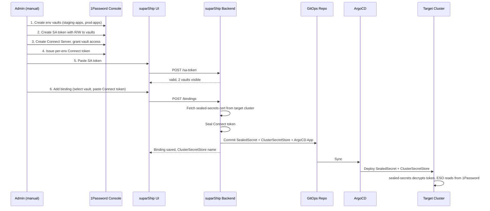

# Secrets Management

suparShip provides a five-level secret hierarchy (org → environment-type → project → app → app-environment) with values stored in **1Password** and materialised at runtime by the [External Secrets Operator](https://external-secrets.io) (ESO).

The setup is **opinionated by design** — there is one supported way to wire 1Password into suparship. Fewer knobs, less cognitive load, easier audits.

## TL;DR

- Two credential types: a **Service Account (SA) token** for suparShip to write secrets, and **per-env Connect tokens** for ESO to read them.
- Paste the SA token, then **Add Binding** per environment (pick vault, paste Connect token). Done.
- suparShip seals each Connect token, commits SealedSecret + ClusterSecretStore to GitOps, and saves the binding.

## Architecture



**Two credential types, two purposes:**

- **SA token** (stored in suparShip): suparShip uses it to write/read/delete secret items in 1Password vaults (the data plane for developer secrets).
- **Connect token** (sealed, deployed to target cluster): ESO uses it to read secret values from 1Password vaults at runtime.

> **Why two tokens?** 1Password Service Account tokens [cannot issue Connect server tokens or grant Connect servers vault access](https://1password.community/discussion/167592). The Connect token must be created manually in the 1Password web console.

## Admin walkthrough

### Prerequisites

Before you begin, you need:

1. A **1Password account** with admin access to create vaults, Service Accounts, and Connect Servers.
2. **sealed-secrets** installed on each target cluster (suparship can install it for you — see Step 2).
3. **External Secrets Operator** installed on each target cluster (suparship can install it for you — see Step 2).
4. **1Password Connect** deployed and accessible from target clusters.

### Step 1: Create vaults in 1Password

In the 1Password web console:

1. Create one vault per environment (e.g. `staging-apps`, `prod-apps`).
2. Create a **Service Account** with Read & Write access to these vaults.
3. Copy the SA token.

### Step 2: Save the SA token in suparShip

**UI:** Settings → Secrets Backend → Provider: 1Password → Paste SA token → Save

**CLI:**
```bash
suparship secrets sa-token --from-file=sa-token.txt
```

suparShip validates the token and shows how many vaults are accessible. The token is stored as a Kubernetes Secret in `suparship-system/suparship-op-sa-token`.

### Step 3: Check cluster prerequisites

**UI:** Settings → Secrets Backend → Prerequisites section shows green/red for each component.

If sealed-secrets or ESO are missing, suparShip offers a one-click install that publishes an ArgoCD Application for each:

```bash
suparship secrets status
```

The installer uses pinned chart versions:
- sealed-secrets: `2.16.2` from `bitnami-labs.github.io/sealed-secrets`
- external-secrets: `0.10.7` from `charts.external-secrets.io`

### Step 4: Set up 1Password Connect

In the 1Password web console:

1. Create a **Connect Server**.
2. Grant it access to your environment vaults.
3. Deploy 1Password Connect to your tooling cluster (using the official Helm chart or Docker image).
4. Issue **per-env Connect tokens** — one token scoped to each vault.

### Step 5: Add bindings per environment

**UI:** Settings → Secrets Backend → "+ Add Binding" → select vault from dropdown → paste Connect token → Submit

**CLI:**
```bash
suparship secrets bind --env=staging --vault-id=abc-123 --connect-token-file=staging-token.txt
suparship secrets bind --env=prod --vault-id=def-456 --connect-token-file=prod-token.txt
```

For each binding, suparShip:

1. Fetches the target cluster's sealed-secrets certificate.
2. Seals the Connect token.
3. Publishes to GitOps: `SealedSecret` + `ClusterSecretStore` + ArgoCD `Application`.
4. Saves the binding state with the `ClusterSecretStoreName` for ExternalSecret generation.
5. Emits an audit log entry.

ArgoCD picks up the committed files and the target cluster materialises the Connect token Secret + ClusterSecretStore. ESO is then ready to satisfy `ExternalSecret` resources for that environment.

### Step 6: Verify

```bash
suparship secrets status
```

```
Backend: onepassword
Group: Suparship

ENV           VAULT ID                                  BOUND           CLUSTER SECRET STORE            LAST ERROR
staging       abc-123-def-456-ghi-789                   yes             onepassword-staging             -
prod          jkl-012-mno-345-pqr-678                   yes             onepassword-prod                -
```

### Rotating a Connect token

Re-running **Add Binding** for an already-bound environment performs rotation:

1. New Connect token is sealed and published to GitOps.
2. ArgoCD syncs the updated SealedSecret.
3. Revoke the old Connect token manually in 1Password.

### Removing a binding

**UI:** Environments table → **Remove**

**CLI:**
```bash
suparship secrets unbind --env=staging
```

This removes the binding from org config. The vault and its contents are preserved in 1Password. The admin should clean up the Connect token and vault manually if no longer needed.

## Security guarantees

| Risk | Mitigation |
|------|------------|
| SA token blast radius | suparShip validates vault count on paste. Scope to specific vaults only. |
| SA token leak from cluster | K8s Secret restricted via RBAC to the suparship controller ServiceAccount only. |
| Per-env credential blast radius | Each environment gets its own Connect token scoped to exactly one vault. |
| Connect token in Git | Always sealed before commit. Plaintext never crosses the suparship process boundary except during in-memory seal. |
| Token rotation | Re-bind with new token. Old token must be revoked manually in 1Password. |
| Audit trail | Every binding/unbinding operation is logged with actor, env, vault, and result. |

## Audit logging

Every write/delete operation emits a structured log line:

```json
{
  "ts": "2026-04-19T12:00:00Z",
  "actor": "alice",
  "action": "bind",
  "env": "prod",
  "vaultId": "abc-123",
  "result": "ok",
  "latencyMs": 142
}
```

Key names and outcomes are logged; **secret values, SA tokens, and Connect tokens are never logged**.

## Install-time tunables

| Setting | Default | Description |
|---------|---------|-------------|
| `onepassword.groupName` | `Suparship` | 1Password group name (informational) |
| `onepassword.connectNamespace` | `onepassword-connect` | Namespace for managed Connect deployment |
| `secrets.saTokenSecretName` | `suparship-op-sa-token` | K8s Secret name for SA token storage |
| `secrets.connectTokenSecretName` | `op-connect-token-{env}` | K8s Secret name pattern for sealed Connect tokens |

## Hardcoded conventions

These are intentionally not configurable — they keep every install identical and easy to audit.

| Symbol | Value |
|--------|-------|
| SA token K8s Secret | `suparship-op-sa-token` in `suparship-system` |
| Connect token secret pattern | `op-connect-token-{env}` |
| ClusterSecretStore name | `onepassword-{env}` |
| Remote namespace (ESO resources) | `external-secrets` |
| Connect endpoint | `http://onepassword-connect.onepassword-connect.svc.cluster.local:8080` |

## Naming patterns

| Pattern | Default | Example (`project=acme, app=web, env=prod`) |
|---------|---------|---------------------------------------------|
| K8s ExternalSecret + Secret | `{app}` | `web` |
| ClusterSecretStore | `{provider}-{env}` | `onepassword-prod` |
| Vault item: org | `org` | `org` |
| Vault item: env-type | `env-{env}` | `env-prod` |
| Vault item: project | `{project}` | `acme` |
| Vault item: app | `{project}-{app}` | `acme-web` |
| Vault item: app-env | `{project}-{app}-{env}` | `acme-web-prod` |

## Collapsed ExternalSecret model

Each app-env namespace receives **one** `ExternalSecret` (and one K8s `Secret`) named from the app resource pattern (default: `{app}`). Its `dataFrom` lists all inherited scope items in precedence order:

```yaml
apiVersion: external-secrets.io/v1
kind: ExternalSecret
metadata:
  name: web
  namespace: acme-web-prod
  labels:
    app.kubernetes.io/managed-by: suparship
spec:
  refreshInterval: 1h
  secretStoreRef:
    name: onepassword-prod
    kind: ClusterSecretStore
  target:
    name: web
    creationPolicy: Owner
  dataFrom:
    - extract: { key: "org" }
    - extract: { key: "env-prod" }
    - extract: { key: "acme" }
    - extract: { key: "acme-web" }
    - extract: { key: "acme-web-prod" }
```

ESO merges them at sync time; later entries win on key collision (matching the hierarchy precedence). Pod templates use `envFrom: secretRef: name: web`.

Only scopes that actually have keys get a `dataFrom` entry — computed at publish time.

## RBAC matrix

| Scope | Required role |
|-------|--------------|
| org | `org_admin` |
| env-type | `org_admin` |
| project | `project_admin` for the target project |
| app | `developer` (or higher) for the project |
| app-env | `developer` (or higher) for the project |

All scopes are readable by any authenticated user (`viewer` and above). Backend setup, SA token management, and bind/unbind operations are `org_admin`-only.

## Refresh and force-sync

- Default `refreshInterval` is `1h`.
- After saving secrets in the UI, the Save button calls `POST /api/v1/projects/:project/apps/:app/secrets/sync` which bumps a `suparship.io/forced-sync-at` annotation on the ExternalSecret, triggering ESO to re-pull immediately.

## Preview vault scope

All PR previews share the `preview` environment vault. Isolation between previews is namespace + RBAC, not vault-level. Per-PR preview vaults are a future follow-up.

## How to keep going without suparship

The GitOps repository is fully self-contained. `gitops-output/` contains:

- `_infra/secret-stores/{env}/sealed-token.yaml` — sealed Connect token
- `_infra/secret-stores/{env}/store.yaml` — `ClusterSecretStore`
- `_infra/secret-stores/{env}/app.yaml` — ArgoCD `Application` driving the sync
- `{project}/{app}/{env}/external-secret.yaml` — `ExternalSecret` per app-env

Anyone can `kubectl apply` these resources (or have ArgoCD do it) without ever running suparship. suparship is a control plane for the **inputs** (Items in the vault, generated CRs in Git); the runtime is plain ESO + sealed-secrets + ArgoCD.

## Out of scope (this iteration)

- Sealing-cert rotation / re-sealing on cert change.
- Project-level vaults (schema supports it; UI is a follow-up).
- Vault and AWS-SM `VaultWriter` implementations.
- Binary / file secrets (TLS certs, kubeconfigs) — UI accepts only UTF-8 KEY=value, ≤64 KiB.
- Per-PR preview vaults — all previews share the `preview` env vault.
- Vault-side cleanup on binding deletion — items remain in 1Password for the admin to clean up.
- Automated Connect token issuance (blocked by 1Password SA token limitations).
